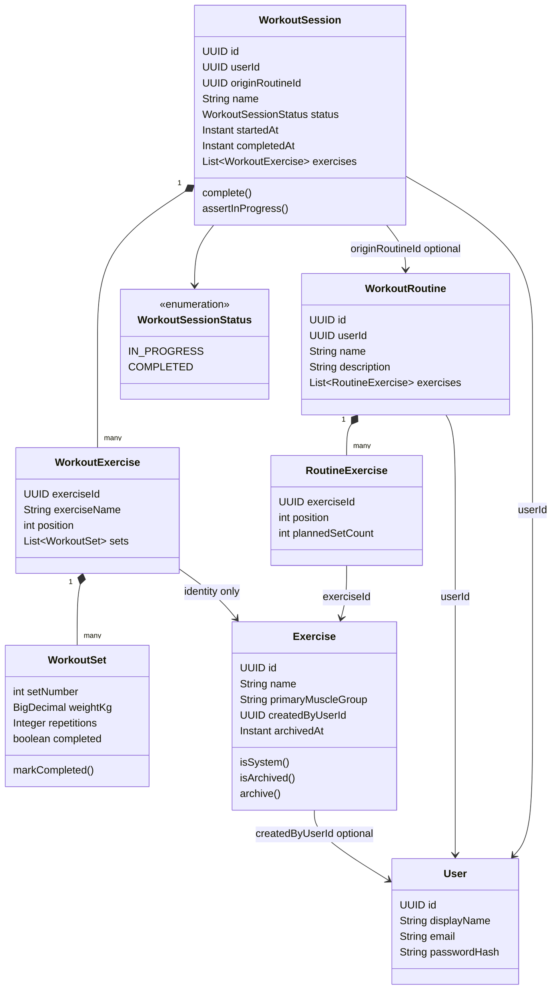
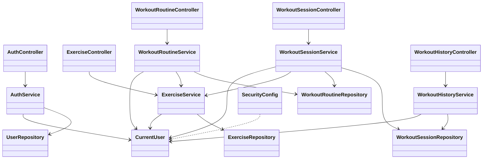

# Workout Tracker — Backend Class Design (MVP)

**Status:** Class-level implementation architecture for the Spring Boot modular monolith.  
**Not in this document:** Java source, JPA annotations, REST path catalogs, Flyway SQL, or frontend classes.

**Precedence:** `mvp-decisions.md` overrides `feature.md`. `architecture-decisions.md` and `database-design.md` are accepted. This design does not reopen them.

---

# 1. Purpose and Scope

This document describes **how the backend is structured in Java packages and classes**: domain entities, application services, repositories, API DTOs, and authorization collaboration.

**Covers:**

- Feature modules and allowed dependencies
- Domain types aligned with `docs/database/database-design.md`
- Service operations for P0 use cases
- Repository query responsibilities
- DTO vs entity boundary
- Where validation and authorization live

**Does not cover:**

- Every Spring-generated bean (`DispatcherServlet`, `EntityManager`, filter chain internals)
- Full `SecurityFilterChain` XML-level internals (only the integration boundary)
- Flyway migration files
- Final URL catalog (later API design)
- UI components
- JWT / refresh-token classes (rejected, ADR-006)

The goal is a **practical solo-developer layout**: three feature modules (auth, exercise, workout), not a class per use case and not a microservice per table.

---

# 2. Package and Module Organization

Recommended root: `com.workouttracker`.

HLD modules **auth**, **exercise**, and **workout** remain. History and previous performance are **not** a fourth deployable module; they are application types **inside workout** because they read/write the same `WorkoutSession` aggregate.

```text
com.workouttracker
  WorkoutTrackerApplication
  common
    exception          # ApiExceptionHandler, domain exceptions used across modules
    security           # SecurityConfig, CurrentUser, UserPrincipal
  auth
    api
    application
    domain
    infrastructure
  exercise
    api
    application
    domain
    infrastructure
  workout
    routine.api | application | domain | infrastructure
    session.api | application | domain | infrastructure
    history.api | application          # no extra aggregate; uses session domain + repos
```

`common` holds cross-cutting HTTP/security only. Domain types stay in feature packages.

### Authentication / User (`auth`)

| | |
| --- | --- |
| **Responsibility** | Register, login, logout; persist `app_user`; expose current user identity. No password-reset or email-verification types. |
| **Domain** | `User` (maps `app_user`) |
| **Application** | `AuthService` |
| **API** | `AuthController` |
| **Repository** | `UserRepository` — find by email, save |
| **Depends on** | Spring Security, `PasswordEncoder`, `common.security`. Does **not** depend on exercise or workout. |

User account and authentication live together: there is no separate user-profile product besides signup display name.

### Exercise (`exercise`)

| | |
| --- | --- |
| **Responsibility** | Catalog + custom exercises; picker queries; create/edit/archive custom; refuse mutation of system rows. |
| **Domain** | `Exercise` |
| **Application** | `ExerciseService` |
| **API** | `ExerciseController` |
| **Repository** | `ExerciseRepository` — picker, owner lookups |
| **Depends on** | `CurrentUser` / user id. Does **not** depend on workout. Workout depends on exercise for “is this pickable?” |

### Workout (`workout`) — routines, sessions, history

One module, three **packages** so the largest module stays navigable.

#### Routine (`workout.routine`)

| | |
| --- | --- |
| **Responsibility** | User templates: CRUD, reorder, planned set count, unique exercise per routine. |
| **Domain** | `WorkoutRoutine`, `RoutineExercise` |
| **Application** | `WorkoutRoutineService` |
| **API** | `WorkoutRoutineController` |
| **Repository** | `WorkoutRoutineRepository` (aggregate load/save). Optional `RoutineExerciseRepository` only if needed for queries; prefer cascade via the root. |
| **Depends on** | `exercise.ExerciseService` or `ExerciseRepository` **via service** to resolve pickable exercises. Does not load sessions. |

#### Session (`workout.session`)

| | |
| --- | --- |
| **Responsibility** | Active workout: start, resume, log, complete, discard (physical delete). |
| **Domain** | `WorkoutSession`, `WorkoutExercise`, `WorkoutSet`, `WorkoutSessionStatus` |
| **Application** | `WorkoutSessionService` |
| **API** | `WorkoutSessionController` |
| **Repository** | `WorkoutSessionRepository` (aggregate with children) |
| **Depends on** | `WorkoutRoutineService`/`WorkoutRoutineRepository` (read template at start); `ExerciseService` (pickable + current name for snapshot). |

#### History / previous performance (`workout.history`)

| | |
| --- | --- |
| **Responsibility** | Completed-session list/detail/delete; previous-performance query. **No new aggregate root.** |
| **Domain** | None extra — uses `WorkoutSession` graph |
| **Application** | `WorkoutHistoryService` |
| **API** | `WorkoutHistoryController` |
| **Repository** | Same `WorkoutSessionRepository` (and query methods for completed + latest-by-exercise). Do not add `History` entity. |
| **Depends on** | Session persistence only. Must **not** join live `WorkoutRoutine` for display. |

**Avoided coupling:** exercise must not import workout. Auth must not import workout. Routine start reads exercise + routine; session mutations do not rewrite `Exercise` or `WorkoutRoutine`.

---

# 3. Domain Model Overview

Aligned with `database-design.md`. Enums/strings for status match persisted values `IN_PROGRESS` and `COMPLETED` only.

### User

- **Responsibility:** Account identity and credentials at rest.
- **State:** `id`, `displayName`, `email`, `passwordHash`, timestamps. Hash never mapped to API DTOs.
- **Lifecycle:** Created at register; no account-deletion API.
- **Relationships:** Owns routines, sessions, and custom exercises (by id, not required as JPA inverse collections everywhere).

### Exercise

- **Responsibility:** Current catalog definition (system or custom).
- **State:** `id`, `name`, `primaryMuscleGroup`, `secondaryMuscleGroups`, `category`, `createdByUserId` (null = system), `archivedAt`.
- **Lifecycle:** System: seed, immutable to users. Custom: create/edit by owner; archive sets `archivedAt` (not hard delete).
- **Relationships:** Referenced by `RoutineExercise` and `WorkoutExercise`. History display does **not** use this `name` after snapshot.

### WorkoutRoutine

- **Responsibility:** Current template aggregate root.
- **State:** `id`, `userId`, `name`, `description`, ordered `exercises`.
- **Lifecycle:** Create/update/delete. Delete does not delete sessions.
- **Relationships:** Contains `RoutineExercise`. Optional origin of `WorkoutSession.originRoutineId`.

### RoutineExercise

- **Responsibility:** Template slot: live `exerciseId`, `position`, `plannedSetCount`.
- **State:** as columns; no weight/reps targets.
- **Lifecycle:** Exists only with the routine (cascade delete with parent).
- **Relationships:** Child of `WorkoutRoutine`; FK to `Exercise`.

### WorkoutSession

- **Responsibility:** Logged workout aggregate root; **historical record** when `COMPLETED`.
- **State:** `id`, `userId`, `originRoutineId` (nullable), `name` (copied or supplied), `status`, `startedAt`, `completedAt`. Duration is **derived** (`completedAt - startedAt`), not a field.
- **Lifecycle:** Insert `IN_PROGRESS` → update children while in progress → `complete()` sets `COMPLETED` + `completedAt` **or** discard **deletes** the aggregate. No `DISCARDED` type.
- **Relationships:** Contains `WorkoutExercise`. Weak optional link to routine.

### WorkoutExercise

- **Responsibility:** Session block with **snapshot name** + **stable exercise id**.
- **State:** `exerciseId`, `exerciseName` (snapshot), `position`, `sets`.
- **Lifecycle:** Added/removed only while session is `IN_PROGRESS`. Frozen when completed. Deleted with session.
- **Relationships:** Child of `WorkoutSession`; FK to `Exercise` for identity only.

### WorkoutSet

- **Responsibility:** One logged set (kg, reps, completed flag).
- **State:** `setNumber`, `weightKg`, `repetitions`, `completed`.
- **Lifecycle:** Mutable only in `IN_PROGRESS`. Incomplete rows may remain after complete; completed-workout **reads** filter `completed == true`.
- **Relationships:** Child of `WorkoutExercise`.

---

# 4. Detailed Class Design

Meaningful classes only. DTOs named by purpose; exact record fields belong in a later API spec.

## Authentication

### `AuthController`

- **Layer:** `auth.api`
- **Responsibility:** HTTP signup, login, logout, current-user. Maps DTOs ↔ service. No business rules.
- **Dependencies:** `AuthService`
- **Operations:** `register`, `login`, `logout`, `me`

### `AuthService`

- **Layer:** `auth.application`
- **Responsibility:** Normalize email; hash password; create `User`; authenticate via `AuthenticationManager` / `SecurityContext`; logout invalidates **HTTP session**. No JWT issuance.
- **Dependencies:** `UserRepository`, `PasswordEncoder`, Spring Security `HttpServletRequest`/`SecurityContext` (or a thin `SecuritySessionSupport`)
- **Operations:** `register`, `login`, `logout`, `getCurrentUserProfile`

### `User`

- **Layer:** `auth.domain` (JPA entity)
- **Fields:** match `app_user`
- **Operations:** no password verification methods that duplicate Spring; factory `register(...)` may live on service

### `UserRepository`

- **Layer:** `auth.infrastructure`
- **Operations:** `save`, `findById`, `findByEmail`, `existsByEmail`

### `UserPrincipal` (or `AppUserDetails`)

- **Layer:** `common.security`
- **Responsibility:** `UserDetails` adapter: `id`, email, password hash, authorities (single role `USER` is enough). Used by Spring Security; **not** a token class.

### `CurrentUser`

- **Layer:** `common.security`
- **Responsibility:** Resolve authenticated `UUID userId` (and display name if needed) from `SecurityContext`. Services take `UUID currentUserId` or `CurrentUser` — never trust a user id from the request body as owner.
- **Operations:** `id()`, optional `requireAuthenticated()`

### `SecurityConfig`

- **Layer:** `common.security`
- **Responsibility:** Session cookie (`HttpOnly`, `Secure` in prod), CSRF for cookie API, CORS with credentials, form/JSON login endpoint wired to `AuthService` or `AuthenticationFilter` as chosen at implementation. **No** `JwtEncoder`, **no** refresh-token beans.
- **Keep thin:** one configuration class, not a security framework rewrite.

### `ApiExceptionHandler`

- **Layer:** `common.exception`
- **Responsibility:** Map domain exceptions to consistent JSON (401, 404, 409, 400).

---

## Exercise

### `Exercise`

- **Layer:** `exercise.domain` (JPA entity)
- **Responsibility:** System vs custom via `createdByUserId == null`.
- **Operations (domain helpers, not REST):** `isSystem()`, `isCustom()`, `isArchived()`, `archive(clock)`, `assertOwnedBy(userId)`, `assertMutableBy(userId)` (rejects system and non-owners)

### `ExerciseService`

- **Layer:** `exercise.application`
- **Responsibility:** List/search/filter pickable exercises; create/update/archive custom; never update system rows.
- **Dependencies:** `ExerciseRepository`, `CurrentUser` / user id
- **Operations:** `listPickable`, `getForPicker`, `createCustom`, `updateCustom`, `archiveCustom`, `requirePickable(exerciseId, userId)` used by workout

`requirePickable`: system **or** (`createdByUserId == userId` **and** `archivedAt == null`).

### `ExerciseRepository`

- **Layer:** `exercise.infrastructure`
- **Operations:** See §7.

### `ExerciseController`

- **Layer:** `exercise.api`
- **Responsibility:** Browse/search/filter; custom create/edit/archive. No workout logging.

---

## Workout Routine

### `WorkoutRoutine`

- **Layer:** `workout.routine.domain` (aggregate root, JPA entity)
- **Fields:** `id`, `userId`, `name`, `description`, `List<RoutineExercise> exercises`
- **Operations:** `replaceExercises(...)`, `assertOwnedBy`, `assertUniqueExerciseIds` (defensive; DB unique is backstop)

### `RoutineExercise`

- **Layer:** same package (JPA entity, **not** an aggregate root)
- **Fields:** `exerciseId`, `position`, `plannedSetCount`
- **Operations:** none beyond construction/invariants (`plannedSetCount >= 1`, `position >= 1`)

### `WorkoutRoutineService`

- **Layer:** `workout.routine.application`
- **Operations:** `create`, `update` (name, description, ordered slots with planned counts), `delete`, `get`, `listByUser`
- **Dependencies:** `WorkoutRoutineRepository`, `ExerciseService.requirePickable` for each slot
- **Delete:** delete routine aggregate only; sessions keep snapshots (`ON DELETE SET NULL` at DB)

### `WorkoutRoutineRepository`

- Load by `id` **and** `userId` with exercises ordered by `position`.

### `WorkoutRoutineController`

- CRUD HTTP; maps DTOs; no repositories.

---

## Workout Session

### `WorkoutSessionStatus`

- Enum: `IN_PROGRESS`, `COMPLETED` only.

### `WorkoutSession`

- **Layer:** `workout.session.domain` (aggregate root)
- **Fields:** as table; `List<WorkoutExercise> exercises`
- **Operations:**
  - factories: `startFromRoutine(...)`, `startEmpty(...)`
  - `assertInProgress()` / `assertOwnedBy`
  - `addExercise(snapshot, position, initialSets)`
  - `removeExercise(workoutExerciseId)`
  - `addSet` / `updateSet` / `removeSet` / `markSetCompleted`
  - `complete(clock)` — requires ≥1 completed set; sets status and `completedAt`
  - `duration()` — `Duration` between timestamps when completed; empty/optional while in progress
- **Must not:** `discard()` as a status transition. Discard is **repository delete** of an in-progress aggregate.

### `WorkoutExercise`

- **Fields:** `exerciseId`, `exerciseName` (snapshot), `position`, `List<WorkoutSet> sets`
- **Operations:** add/remove/update sets while parent in progress; snapshot name is **immutable** after construction

### `WorkoutSet`

- **Fields:** `setNumber`, `weightKg`, `repetitions`, `completed`
- **Operations:** `applyLog(weight, reps)`, `markCompleted()` (requires values)

### `WorkoutSessionService`

- **Layer:** `workout.session.application`
- **Operations:** `startFromRoutine`, `startEmpty`, `getInProgress` (resume), `addExercise`, `removeExercise`, `addSet`, `updateSet`, `removeSet`, `markSetCompleted`, `complete`, `discard`
- **Dependencies:** `WorkoutSessionRepository`, `WorkoutRoutineRepository`/`Service` (read-only at start), `ExerciseService`
- **Transactions:** each mutating use case `@Transactional`
- **Start:** if `findInProgress(userId)` present → conflict (409); else persist new aggregate (partial unique index backstop)
- **Discard:** `findByIdAndUserIdAndStatus(IN_PROGRESS)` then `delete` — not `save` with a discarded flag
- **Complete:** load in-progress aggregate, `complete()`, save

### `WorkoutSessionRepository`

- See §7.

### `WorkoutSessionController`

- Active-session HTTP surface (start, get current, mutations, complete, discard).

---

## Workout History / Previous Performance

No `History` entity. No `PersonalRecord` type.

### `WorkoutHistoryService`

- **Layer:** `workout.history.application`
- **Operations:**
  - `listCompleted(userId)` — newest `completedAt` first
  - `getCompletedDetail(userId, sessionId)` — 404 if not owned or not `COMPLETED`
  - `deleteCompleted(userId, sessionId)` — physical delete of **completed** aggregate only
  - `getPreviousPerformance(userId, exerciseId)` — latest completed session containing that `exerciseId`; return **completed** sets (and snapshot name from that block)
- **Dependencies:** `WorkoutSessionRepository` only
- **Must not:** update sets; must not load routine for names

### `WorkoutHistoryController`

- History list/detail/delete; previous-performance may be a dedicated GET **or** embedded in the active-session response via `WorkoutSessionService` calling `WorkoutHistoryService` (same module; either is fine). Prefer **one** previous-performance implementation on `WorkoutHistoryService` to avoid duplicate queries.

---

# 5. Aggregate and Ownership Boundaries

| Root | Children | Independent? |
| --- | --- | --- |
| `User` | none in this module | Yes — auth aggregate |
| `Exercise` | none | Yes — catalog; not a child of routine/session |
| `WorkoutRoutine` | `RoutineExercise` | Yes — template aggregate |
| `WorkoutSession` | `WorkoutExercise` → `WorkoutSet` | Yes — **the** historical/logging aggregate |

**WorkoutRoutine is the aggregate root for `RoutineExercise`.** Reorder, add/remove slots, and planned counts go through `WorkoutRoutineService` loading the routine, mutating the collection, saving once. Do not expose a public “update RoutineExercise by id” API that bypasses uniqueness/order invariants.

**WorkoutSession is the aggregate root for `WorkoutExercise` and `WorkoutSet`.** All logging mutations load the session (with children), assert `IN_PROGRESS` and owner, mutate, save. Repositories should not update a `WorkoutSet` row in isolation from a service that skipped the session status check.

**Exercise is independently managed.** Starting a session **copies** name onto `WorkoutExercise`; it does not nest `Exercise` inside the session aggregate. Session must not `save` `Exercise`.

**User is independently managed.** Other aggregates store `userId` (`UUID`), not a required JPA `ManyToOne` graph of all routines (avoid loading the world). Optional `ManyToOne` to `User` is an implementation choice; ownership checks use `userId` equality.

**Child mutations:** always via the root’s service in a transaction. Cascade persist/delete on the session/routine matches the database design.

---

# 6. Application Service / Use Case Design

Group by service; not one class per operation.

| Service | Operations |
| --- | --- |
| **AuthService** | Register; Login; Logout; current profile |
| **ExerciseService** | Create custom; Edit custom; Archive custom; list/search/filter pickable |
| **WorkoutRoutineService** | Create; Update (including reorder + planned set counts); Delete; Get; List |
| **WorkoutSessionService** | Start from routine; Start empty; Resume (`getInProgress`); Add/remove exercise; Add/update/remove set; Mark set completed; Complete; Discard |
| **WorkoutHistoryService** | List history; Get detail; Delete completed item; Get previous performance |

Dashboard totals (completed workout count, completed set count, most recent session) can be thin methods on `WorkoutHistoryService` or `WorkoutSessionRepository` counts — **not** a new Dashboard module. Omit streak.

---

# 7. Repository Design

Spring Data JPA interfaces. Persistence only; no complete-gate logic.

### `UserRepository`

- `Optional<User> findByEmail(String email)`
- `boolean existsByEmail(String email)`
- `Optional<User> findById(UUID id)`

### `ExerciseRepository`

- `Optional<Exercise> findById(UUID id)`
- `Optional<Exercise> findByIdAndCreatedByUserId(UUID id, UUID userId)` — custom owner
- Pickable list: system (`createdByUserId` is null) **or** (`createdByUserId = userId` and `archivedAt` is null), with optional name search and `primaryMuscleGroup` filter
- Do **not** return another user’s custom rows

### `WorkoutRoutineRepository`

- `Optional<WorkoutRoutine> findByIdAndUserId(UUID id, UUID userId)` with exercises ordered
- `List<WorkoutRoutine> findByUserIdOrderByUpdatedAtDesc(UUID userId)`

### `WorkoutSessionRepository`

- `Optional<WorkoutSession> findByUserIdAndStatus(UUID userId, IN_PROGRESS)` — resume; at most one
- `Optional<WorkoutSession> findByIdAndUserId(UUID id, UUID userId)` — always owner-scoped
- `Optional<WorkoutSession> findByIdAndUserIdAndStatus(...)` — discard vs history delete
- `List<WorkoutSession> findByUserIdAndStatusOrderByCompletedAtDesc(UUID userId, COMPLETED)` — history
- Previous performance: latest `COMPLETED` session for `userId` that has a `WorkoutExercise` with `exerciseId`, ordered by `completedAt` desc (custom `@Query` joining children)
- `delete` for discard and history delete (cascade children)

**Load graphs:** use entity graph / join fetch so start/resume/complete see ordered exercises and sets. Avoid N+1 on the active-session payload.

**Ownership:** every find used by mutating/read APIs includes `userId` except system exercise catalog reads.

---

# 8. DTO and API Boundary Design

| Type | Role |
| --- | --- |
| Request DTOs (Java records) | Bean Validation on input (`@NotBlank` email, `@Positive` plannedSetCount). No JPA relations. |
| Response DTOs (records) | What the SPA needs: session with snapshot names, derived duration, completed-set flags. **No `passwordHash`.** |
| Domain / JPA entities | Persistence and invariants. |

**Do not return entities from controllers.** Reasons: lazy-load exceptions; leaking password hashes and internal ids graphs; coupling API to schema; accidental mutation of managed entities.

Mapping: package-private mappers or static methods on the api package (`ExerciseMapper.toResponse`). Keep mapping out of repositories.

Previous-performance response: snapshot name + completed sets from the **past** session — not live `Exercise.name`.

---

# 9. Validation and Business Rule Placement

| Rule | Placement |
| --- | --- |
| Email format, non-blank display name/password, string lengths | **Bean Validation** on request DTOs |
| `@Positive` planned set count, `@Min(1)` set number / position | **Bean Validation** on requests; **DB CHECK** as backstop |
| Non-negative weight/reps | Bean Validation + DB CHECK |
| Completed set must have weight and reps | **Domain** `WorkoutSet.markCompleted` + **DB CHECK** |
| Unique email | **DB UNIQUE** + service `existsByEmail` for a clear 409/400 |
| One `IN_PROGRESS` per user | **Service** pre-check (409) + **partial unique index** |
| ≥1 completed set to complete workout | **Domain** `WorkoutSession.complete` / **service** |
| User ownership | **Service** + **repository** `...AndUserId` |
| System exercise immutability; archive only custom | **Exercise** helpers + **ExerciseService** |
| Pickable exercise only | **ExerciseService.requirePickable** |
| Unique exercise per routine | **Service** + **DB UNIQUE** |
| No mutation of `COMPLETED` sessions | **Domain** `assertInProgress` on mutators + **service**; history delete is delete, not update |
| Snapshot name at add | **WorkoutSessionService** copies `Exercise.getName()` into `WorkoutExercise` constructor |
| Duration | **Derived** on DTO/domain getter, not a writable field |
| CSRF/CORS/session cookie | **SecurityConfig**, not domain |

Controllers: validate DTOs, then service. Services: transactions and authorization. Database: last-line invariants.

---

# 10. Authorization Design at the Class Level

1. `SecurityFilterChain` authenticates the request (session cookie). Unauthenticated → 401.
2. `CurrentUser.id()` is the only owner id for writes.
3. Path/body resource ids (`routineId`, `sessionId`, `exerciseId`) are **lookups**, not proof of ownership.
4. Services call `findByIdAndUserId` / `requirePickable`. Empty → 404 (do not leak existence of another user’s row).
5. Custom exercise update/archive: `findByIdAndCreatedByUserId`; system `createdByUserId == null` → 403/404, never update.
6. Discard: status must be `IN_PROGRESS` and owner match.
7. History delete: status must be `COMPLETED` and owner match.
8. Picker queries include the ownership predicate in the repository method, not only in the controller.

Frontend-supplied `userId` on DTOs is rejected or ignored.

---

# 11. Class Diagram

### Domain



### Application and persistence



Controllers do not depend on repositories. History service does not depend on `WorkoutRoutineService`.

---

# 12. Important Interaction Patterns

### 1. Start workout from routine

`WorkoutSessionController` → `WorkoutSessionService.startFromRoutine(currentUserId, routineId)`  
→ `findInProgress` empty or 409  
→ `WorkoutRoutineRepository.findByIdAndUserId`  
→ for each `RoutineExercise`: `ExerciseService.requirePickable` + read **current** name  
→ `WorkoutSession.startFromRoutine` copies name, origin id, positions, `plannedSetCount` empty sets, **snapshots** `exerciseName`  
→ `WorkoutSessionRepository.save`  
Routine entity is not updated.

### 2. Complete workout

`WorkoutSessionService.complete(currentUserId)`  
→ load `IN_PROGRESS` by user  
→ `session.complete()` (fails if no completed set)  
→ save `COMPLETED` + `completedAt`  
No catalog/routine writes.

### 3. Discard workout

`WorkoutSessionService.discard(currentUserId)`  
→ load `IN_PROGRESS` by user  
→ `WorkoutSessionRepository.delete` (cascade children)  
No `DISCARDED` persist. History queries never see the row.

### 4. Get previous performance

`WorkoutHistoryService.getPreviousPerformance(currentUserId, exerciseId)`  
→ repository: latest `COMPLETED` session for user containing that `exerciseId`  
→ map **that** `WorkoutExercise.exerciseName` and completed `WorkoutSet`s to a DTO  
Does not use live `Exercise.name`. Does not create a PR entity.

---

# 13. Dependency Rules

```text
Controller (api)
    → Application service
        → Domain entities (in-memory)
        → Repository (same module)
        → Other module's *service* only (not its repository)

common.security / common.exception
    ← used by api and application
    → must not depend on workout/exercise domain
```

**Allowed:** `workout` application → `exercise` `ExerciseService` (pickable + name).  
**Forbidden:** `exercise` → `workout`; `UserRepository` used from workout to bypass auth; repositories → controllers; entities → REST DTOs; domain → Spring Web.

Prefer constructor injection. No field injection.

---

# 14. Mapping to Database Design

| Domain / type | Table / persistence |
| --- | --- |
| `User` | `app_user` — JPA entity |
| `Exercise` | `exercise` — JPA entity |
| `WorkoutRoutine` | `workout_routine` — JPA entity |
| `RoutineExercise` | `routine_exercise` — JPA entity, collection on routine |
| `WorkoutSession` | `workout_session` — JPA entity |
| `WorkoutExercise` | `workout_exercise` — JPA entity; field `exerciseName` ← column `exercise_name` snapshot |
| `WorkoutSet` | `workout_set` — JPA entity |
| `WorkoutSessionStatus` | `workout_session.status` check constraint |
| `AuthService`, `CurrentUser`, `SecurityConfig` | **No table** (HTTP session outside application schema) |
| `WorkoutHistoryService` | **No table** — queries `workout_session` / children |
| Request/response records | **No table** |
| Derived `duration` | **No column** |

Snapshot: `WorkoutExercise.exerciseName` is a normal String field populated at add/start, never refreshed from `Exercise` on complete.

---

# 15. Open Questions

| Question | Classification | Notes |
| --- | --- | --- |
| Previous performance as nested active-session DTO vs separate GET | NON-BLOCKING | One `WorkoutHistoryService` method either way |
| `ManyToOne User` on entities vs `UUID userId` only | NON-BLOCKING | `userId` is enough for ownership; FK still exists in DB |
| Login as JSON on `AuthController` vs `AuthenticationFilter` | NON-BLOCKING | Must still create HTTP session cookie (ADR-006) |
| Default set count when adding an exercise to an empty session | NON-BLOCKING | Product unspecified; service must pick an explicit application default or require a request field — not a new product feature in this doc |
| Muscle filter primary vs secondary | NON-BLOCKING | Repository predicate later |
| Entity-graph vs explicit fetch-join for session load | NON-BLOCKING | Implementation |
| Rest timer, PRs, notes, JWT | DEFERRED / rejected | No classes now |

No **BLOCKING** class-level questions. Accepted ADRs are not reopened.

---

# Final Self-Review

| Check | Result |
| --- | --- |
| P0 backend capabilities mapped to services | Yes — auth, exercise, routine, session, history, previous performance |
| Matches database-design.md | Same seven entities; snapshot field; no duration column; no DISCARDED |
| WorkoutSession is history aggregate | Yes; history service has no extra root |
| Routine/exercise edits do not mutate session children | Start copies; complete does not re-snapshot from catalog |
| Status enum IN_PROGRESS / COMPLETED only | Yes |
| Discard = delete in-progress aggregate | Yes |
| No JWT/refresh | Yes |
| Ownership via CurrentUser + `findByIdAndUserId` | Yes |
| Entities not REST responses | DTO boundary in §8 |
| Solo-practical packages | Three modules; history is a package inside workout |
| No extra abstraction layers | No CQRS buses, no hexagonal ports explosion |

**No unsupported approved requirement identified.** HTTP session storage remains outside the domain model (ADR-006).
