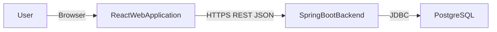
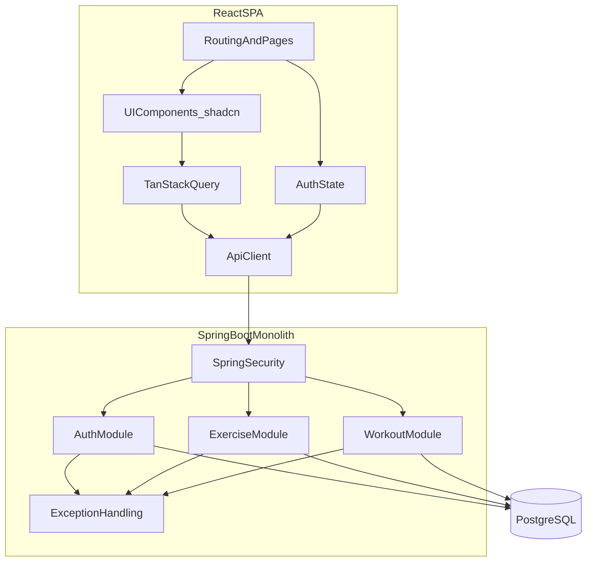
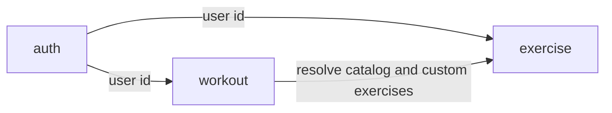
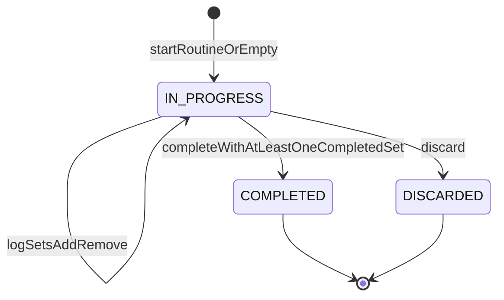

# Workout Tracker — High-Level Design (MVP)

**Status:** Architecture for the approved MVP slice.  
**Product precedence:** `docs/product/mvp-decisions.md` overrides `docs/product/feature.md` on conflict. Remaining non-blocking product questions are not resolved here by inventing requirements.  
**Not in this document:** table schemas, Flyway migrations, Java types, REST path catalogs, or UI mockups.

---

# 1. Purpose and Scope

The system helps a signed-in user **plan strength-training routines**, **log sets (kg and repetitions) during a workout session**, and **review completed sessions**, including **previous performance** for the same exercise while logging.

It is a **browser-based** application: a React SPA talks to a **single Spring Boot** process over **REST**, with **PostgreSQL** as the system of record. The backend is a **modular monolith**, not a set of independently deployable services.

## MVP capabilities

Supported by this design:

- Email and password signup (required display name), login, logout
- Private, per-user data
- Dashboard: greeting, start workout (choose a routine **or** start empty), routine list, most recent completed session, basic totals **excluding streak**
- Routine create / edit / delete / reorder; planned **set count** per routine exercise; at most one occurrence of an exercise per routine
- Curated **global exercise catalog**; user **custom exercises** (create, edit, hide/archive)
- Exercise browse, search, filter by muscle group; on **mobile**, catalog access via **Add Exercise** (routine editor or active session)
- Desktop may include a standalone Exercises entry (`feature.md` desktop nav; not overridden)
- Start session from a routine (copy name, exercises, planned set counts) or empty
- **At most one** in-progress session per user, **persisted on the server**, resumable after refresh, close, or another device
- Log weight (kg only) and reps; add/remove sets; mark sets completed; **remove** an exercise from the in-progress session
- Previous performance: latest **completed** session that contains the same exercise (completed sets only)
- Complete only if **at least one** set is marked completed
- History: reverse chronological completed sessions; detail; delete; **no edit**
- Completed duration = `completedAt - startedAt`
- Snapshotted exercise **name** on session exercises so later routine/catalog edits do not rewrite history
- Routine delete allowed even when sessions originated from that routine
- Responsive desktop and mobile; active logging is **mobile-first**; **online-only**

## Deferred capabilities (not designed as MVP features)

Do not add modules, APIs, or UI destinations for these in the first implementation:

- Rest timer (including auto-start)
- Progress charts
- Personal records
- Workout streak
- Duplicate routine
- Dedicated Settings screen
- Password reset and email verification
- Target weight / target reps on routines
- Skip as distinct from remove
- kg/lbs switching
- Exercise notes, workout notes, training volume, data export, dark mode, advanced filters, progress photos (`feature.md` P2)
- Dedicated Progress **screen** as a confirmed MVP destination (product left this open; previous performance on the **active session** is the P0 progress slice)

## Out-of-scope capabilities

Not part of this architecture:

- Account deletion
- Offline-first synchronization
- Social features, AI coaching, wearables, Apple Health / Google Fit, trainer/coaching, payments (`feature.md` §21)
- Supersets, drop sets, RPE, periodization, 1RM and other advanced analytics
- Microservices, Kafka, gRPC, GraphQL, message buses, or extra datastores

---

# 2. Architecture Principles

1. **Simplicity** — Prefer one process, one database, and straightforward request/response flows. A solo developer should be able to run and reason about the whole system.
2. **Modular monolith** — Organize backend code by feature (auth, exercise, workout). Modules are Java packages with clear owners, not separately deployed services.
3. **Clear ownership boundaries** — Each aggregate is owned by one module (users/credentials, exercises, routines, sessions). Other modules call services, not another module’s repositories.
4. **Historical data preservation** — Completed session payload (including snapshotted exercise names and logged sets) must not change when routines or live catalog/custom exercises change. History delete is an explicit user action.
5. **Mobile-friendly frontend** — Active session UI is designed for one-handed gym use: large controls, stacked layout on small screens, few taps to log a set. Desktop uses sidebar navigation and wider tables where useful.
6. **Maintainability** — Controllers stay thin; business rules live in services; APIs use DTOs, not JPA entities; Flyway is the only schema evolution path (`ddl-auto=validate` in controlled environments).
7. **Avoid unnecessary infrastructure** — No cache cluster, search engine, object store, or async platform for MVP. PostgreSQL and the app server are sufficient.

---

# 3. System Context

The only runtime systems in MVP are the user’s browser, the web app, the API, and PostgreSQL. Email delivery, OAuth providers, and mobile native apps are out of scope (no verification email, no Google/Apple sign-in).

**Trust and network boundary:** the SPA is a public client. The API authenticates the user and authorizes every resource. PostgreSQL is not exposed to the browser.

**Optional local/dev only:** the developer’s machine running Vite, Spring Boot, and PostgreSQL (or a local container). That is not an extra production service.

---

# 4. High-Level Component Architecture

## Frontend (minimum)

| Component | Role |
| --- | --- |
| Routing / pages | React Router: public auth pages; authenticated app shell (dashboard, routines, routine editor, desktop exercises, active session, history list/detail). No Settings. No rest-timer or chart pages. |
| UI components | shadcn/ui + Tailwind. Shared primitives (buttons, inputs, dialogs). Feature-specific composites stay next to their pages. |
| API client | Single HTTP helper (base URL, credentials/headers, JSON parse, error mapping). Pages do not call `fetch` ad hoc. |
| Server state | TanStack Query owns remote data (routines, exercises, in-progress session, history). Mutations invalidate or update the relevant queries. |
| Authentication state | Current user (id, display name, email) after login. Token or cookie session is handled by the API client. Unauthenticated users are sent to login. |

## Backend (minimum)

| Component | Role |
| --- | --- |
| Authentication / security | Spring Security filter chain; password hashing; authenticated principal on requests. |
| Exercise management | Global catalog + custom exercises; search/filter; archive custom. |
| Workout routine management | User routines and routine exercises (order, planned set count). |
| Active session management | Start, persist, update sets, remove exercises, complete, discard, enforce one in-progress session. |
| Workout history | List/get/delete **completed** sessions only. |
| Previous performance | Read model over completed sessions/sets, grouped by exercise identity when available. |

Routines, active sessions, history, and previous performance live in **one workout module** (see §5) to avoid a microservice-style split.

## Database

PostgreSQL holds users, exercises, routines, sessions, session exercises (with name snapshot), and sets. Flyway applies schema and **seed data for the curated catalog**. No other persistent store.

---

# 5. Backend Module Boundaries

Three feature modules plus cross-cutting web/security. That is enough for a solo MVP. A fourth “history” or “progress” package is **not** required: completed sessions and previous-performance queries are owned by **workout**.

### auth

- **Responsibility:** Register, authenticate, log out; represent the current user; never expose credential hashes.
- **Owns:** User identity (id, display name, email), password hash at rest, security configuration.
- **Interactions:** Other modules receive `userId` (and display name when needed) from the security context. They do not load password hashes.

### exercise

- **Responsibility:** Curated global catalog; per-user custom exercises; list/search/filter for picking exercises; create/edit custom; hide/archive custom so they are omitted from **future** pickers.
- **Owns:** Exercise definition (name, primary muscle, optional secondary muscles, category, global vs custom, owner of custom, archived flag). Catalog seed content.
- **Interactions:** Workout asks exercise to **resolve** an exercise the user is allowed to add (global or own non-archived custom) and to read current name/identity **at the moment it is placed on a routine or session**. Workout does not update catalog rows when logging. Archive must not rewrite session snapshots.

### workout

- **Responsibility:** Routines (templates) and sessions (logged workouts), including in-progress persistence, complete/discard, history of completed sessions, and previous-performance reads.
- **Owns:** Routine, routine exercise (order, planned set count), session, session exercise (order, snapshotted name, exercise identity when available), session set (weight kg, repetitions, completed flag), session lifecycle.
- **Interactions:** Uses **auth** only via `userId`. Uses **exercise** to validate pickable exercises and to copy name + id onto session/routine rows. Does not call out to a progress service.

Cross-cutting (not a domain module): HTTP exception handler, request DTO validation, CORS. Controllers in each module; no business logic in controllers.

---

# 6. Frontend Architecture

## Page-level structure

Authenticated **app shell**:

- **Desktop:** sidebar — Dashboard, Routines (labeled “Workouts” in UI if desired), Exercises, History. Logout in the shell (not a Settings page). Prominent Start Workout.
- **Mobile:** compact bottom or top nav — Home, Routines, History. Start Workout always easy to reach. **No** Exercises tab; adding exercises opens a picker (search/filter/create custom) from the routine editor or active session.

**Pages (MVP):**

1. Login / Sign up (public)
2. Dashboard
3. Routine list
4. Routine create / edit
5. Exercise library (**desktop**; optional reuse of the same picker as a page)
6. Active session (mobile-first)
7. History list
8. History detail (read-only except delete)

No Settings, rest timer, charts, or PR screens.

## Feature organization

Colocate by feature under the frontend app, for example `features/auth`, `features/exercises`, `features/routines`, `features/session`, `features/history`, plus `components` for shared UI. Keep API types next to the client functions for that feature.

## Routing

React Router: public routes vs authenticated layout. Unknown routes redirect to dashboard or login. If an in-progress session exists, the shell may surface resume (UX copy is unspecified; the **data** is `GET` in-progress). Starting a second session is an API conflict, not a second local draft.

## API communication

- One API client; environment base URL.
- Typed request/response models shared by hooks and pages.
- No duplicate fetches of the same resource from sibling components: lift to a query hook.

## TanStack Query

- **Queries:** current user, dashboard summary, routine list/detail, exercise search, in-progress session, history list/detail, previous performance for an exercise (or embed previous performance in the session payload).
- **Mutations:** signup/login, routine writes, session writes (set log, complete, discard), custom exercise create/edit/archive, history delete.
- After mutations, invalidate the in-progress session query and any history/dashboard queries that would be stale.
- The in-progress session is **server state**, not a long-lived unsynced client store. The client may debounce keystrokes for weight/reps but the source of truth after a successful mutation is the server (online-only).

## Form handling

Signup, login, and routine editor are ordinary forms (controlled components or a lightweight form helper). Routine editor: name, optional description, ordered exercises, **required planned set count** per exercise (no invented default count). Active session logging favors immediate, large numeric inputs over multi-step wizards.

## Authentication handling

- Unauthenticated API responses send the user to login and clear user query cache.
- Authenticated layout waits on “current user” query.
- Logout calls the backend then clears queries.

Mechanism (cookie vs bearer token) is an architectural choice in §14; the frontend only depends on “credentialed API + current user resource.”

## Responsive design

- Tailwind breakpoints: stacked cards and large tap targets on small screens; tables and sidebar on large screens.
- Active session: mobile-first layout even on desktop (still usable, not gym-hostile).
- Tablet: treat as a layout between the two, not a third product.

---

# 7. Major Data Flows

High-level only. No sequence diagrams.

### 1. User authentication

User submits email, password, and (on signup) display name → API validates → auth module creates user or verifies password → security establishes a session → SPA stores auth result via current-user query → subsequent requests carry the credential → logout invalidates the server session (or token) and client cache.

### 2. Create workout routine

Authenticated user opens routine editor → SPA loads pickable exercises from exercise module (global + own non-archived custom) → user names the routine, adds exercises in order, sets planned set count per exercise → POST routine → workout module verifies ownership, uniqueness of exercise ids on that routine, and that each exercise is pickable → persist routine → SPA invalidates routine list.

### 3. Start workout

User chooses a routine or empty start → SPA `POST` start → workout module rejects if an `IN_PROGRESS` session already exists for that user → otherwise create session (`startedAt` now, optional routine id, name from routine or user-supplied name) → if from routine, copy exercises in order and create set **rows** according to planned set count (empty weight/reps, not completed) → snapshot each exercise **name** and keep exercise id → return session → SPA navigates to active session and caches it.

### 4. Log a workout set

User edits weight/reps and marks a set completed (or adds/removes a set) → SPA mutates session → workout module loads the user’s `IN_PROGRESS` session only → update that set → persist → return session (and optionally previous performance already on the payload). Incomplete rows may remain; they are not completed workout data.

### 5. Resume an in-progress workout

On app load or dashboard, SPA `GET` in-progress session → if present, user can open the active session page → same persisted rows as before refresh or another device. No local-only draft. If none, start flow applies.

### 6. Complete a workout

User requests complete → workout module checks the session is `IN_PROGRESS` and **at least one set** is marked completed → set `completedAt`, status `COMPLETED` → duration is derived from timestamps, not a separately authored value → incomplete sets are **not** treated as completed data in history or previous performance → SPA goes to summary/history and invalidates in-progress, history, dashboard.

### 7. View workout history

SPA `GET` completed sessions for the current user, newest first → user opens detail (read-only snapshots, completed sets) → optional `DELETE` of that completed session (explicit; does not delete routines or exercises).

### 8. View previous performance

On the active session, for each (or the focused) exercise, SPA uses data from the session payload or `GET` previous performance → workout module finds the latest `COMPLETED` session for that user that includes the same **exercise identity** (when available), then returns that session’s **completed** sets for that exercise. No chart service.

---

# 8. Session Lifecycle Architecture

Three states only. They match the product: in progress, completed, and discard that is not history.

| State | Meaning |
| --- | --- |
| `IN_PROGRESS` | The user’s single live session. Mutable. Returned by resume. Not listed as history. |
| `COMPLETED` | Passed the complete gate. Immutable except delete-from-history. Duration = `completedAt - startedAt`. |
| `DISCARDED` | User threw the live session away. **Not** history. Must not occupy the “one in-progress” slot. |

**Why `DISCARDED` exists:** Product requires discard without creating a completed record. A terminal status (rather than only an in-memory cancel) keeps the lifecycle explicit and makes the uniqueness rule easy to state: **at most one row per user with status `IN_PROGRESS`**. Physical hard-delete of discarded sessions is an implementation option that is **equivalent** if uniqueness still holds and discarded data never appears in history. Either way, there is no fourth state (no `PAUSED`, no `ABANDONED` vs `DISCARDED`).

**One in-progress session:** Enforced in the workout service on start (and by a database uniqueness constraint when the schema is designed). A second start fails; the client uses GET in-progress + discard or resume. Prompt wording is product/UX, not a new state.

**Persistence and resume:** Every successful mutation of an `IN_PROGRESS` session is written to PostgreSQL. Resume is a read of that row graph (exercises, sets). Online-only: no sync protocol.

**Completion:** Allowed only from `IN_PROGRESS` with ≥1 completed set. After `COMPLETED`, APIs do not accept set edits.

**Discard:** Only from `IN_PROGRESS`. Result is not a history item. Completing after discard is impossible.

**Historical preservation after completion:** Snapshots already on session exercises remain. Later routine edits, routine deletion, custom exercise rename, or archive do not rewrite those fields. Previous performance reads `COMPLETED` data only.

**Incomplete sets:** Completion flag is the product distinction. Architecture does **not** require deleting incomplete rows on complete (product did not decide). Reads that mean “completed workout data” filter to completed sets.

---

# 9. Historical Data Strategy

No final schemas here. The architectural rules:

1. **Session graph is the history record.** What the user logged lives on the session, session exercises, and sets—not as a live view of the current routine.
2. **Name snapshot.** When an exercise is **placed on a session** (start-from-routine copy or add-during-session), copy the **exercise name** onto the session exercise. Completing the session does not re-resolve names from the catalog. This is how empty sessions (exercises added after `startedAt`) still satisfy “history shows the name that was logged,” which is the intent of decision 30.
3. **Stable identity when available.** Also store the exercise id used at add time so previous performance can group by identity after a rename. Archive hides the exercise from pickers; id remains for grouping. If identity were missing, grouping by snapshot name is not specified as a fallback product rule; the design still stores identity whenever the exercise was resolved from the catalog or custom list.
4. **Routine is optional origin, not source of truth.** Session may keep a routine id for traceability. **Deleting a routine must not delete or rewrite completed sessions.** Origin may become empty; session name and snapshots remain.
5. **Editing a routine** after start does not update existing `IN_PROGRESS` or `COMPLETED` sessions (the live session was copied at start; further routine edits are template-only). If product later wanted live template sync, that would be a new requirement.
6. **Custom exercise edit** changes future pickers and new snapshots, not old session names.
7. **Previous performance** is a query: latest `COMPLETED` session for this user containing this exercise id, then that exercise’s completed sets. No separate warehouse.

Routine and catalog tables remain **current** templates. History tables (session*) remain **append/update only while `IN_PROGRESS`**, then freeze.

---

# 10. Security and Data Ownership

MVP-level only.

- **Authentication:** Email + password. Spring Security. No OAuth, no magic links, no email verification, no password reset in this slice (forgotten password is a known product limitation).
- **Password handling:** Hash with a slow password encoder (e.g. BCrypt). Hashes never appear in APIs or logs. Signup requires display name, email, password.
- **Email as login identifier:** Treat email as unique so login is unambiguous (necessary invariant of email/password, not a new user-facing feature).
- **Transport:** HTTPS in deployed environments.
- **Authorization:** Every routine, session, custom exercise, and history item is owned by `userId`. Services load by **id and owner**; missing or other-user ids are the same as not found (no leakage). Global catalog is readable by all authenticated users; only the owner mutates a custom exercise.
- **Session isolation:** Users cannot read or mutate another user’s `IN_PROGRESS` or `COMPLETED` sessions.
- **Logout:** Ends the server credential; client drops cached user data.
- **Not in MVP:** RBAC, API keys, WAF productization, account lockout policy beyond what Spring Security defaults reasonably provide, GDPR erasure (account deletion out of scope).

---

# 11. Error Handling and Validation

| Layer | Responsibility |
| --- | --- |
| Frontend | Immediate UX: required fields, kg-only input affordance, disable Complete until the client knows a set is completed (server still enforces). Show API errors without exposing stack traces. |
| Backend request validation | Bean Validation on request DTOs (presence, size, non-negative numbers where the type implies it). Unknown extra product limits (decimals, max load) are **not** invented here. |
| Business-rule validation | Services: one in-progress session; complete gate; exercise unique on a routine; pickable exercises only; planned set count required; cannot mutate `COMPLETED` sessions; cannot start a second session. |
| API errors | Central `@ControllerAdvice` (or equivalent): consistent JSON (`status`, `code` or `message`, optional field errors). 401 unauthenticated, 403/404 for other users’ resources, 409 for “already have an in-progress session,” 400 for validation. No entity internals in bodies. |

---

# 12. Non-Functional Considerations

Proportional to a personal/small-user MVP.

- **Performance:** Active session is a small object graph; log-set updates should be single-session writes. Previous performance is one indexed lookup of recent completed sessions, not a full history scan per keystroke if the SPA caches it for the session view. No CDN/search cluster required at this scale.
- **Scalability:** Vertical scale of one API + one PostgreSQL is enough. Stateless API instances are possible later if auth is compatible (§14); not a day-one requirement.
- **Reliability:** PostgreSQL is the source of truth for in-progress work; a client crash does not lose a successfully saved set. Online-only: no gym-offline guarantee.
- **Maintainability:** Modular packages, Flyway, tests on workout lifecycle and ownership rules.
- **Observability:** Application logs and HTTP status metrics from the platform; no distributed tracing requirement. Log user id on errors, never passwords.
- **Security:** See §10. Keep dependency updates on Spring Security. CORS allowlist the frontend origin.

---

# 13. Deployment Boundaries

Three deployable pieces, no vendor lock-in in this document:

1. **Frontend** — static SPA (Vite build), served as its own origin or host.
2. **Backend** — one Spring Boot application (modular monolith).
3. **Managed PostgreSQL** — network-restricted to the backend.

The SPA calls the backend over HTTPS. CORS and cookie/token settings must match those two origins. No additional runtime (queue, cache, email, object storage) for MVP.

---

# 14. Key Architectural Decisions and Trade-offs

| Decision | Rationale | Trade-off |
| --- | --- | --- |
| Single Spring Boot modular monolith + React SPA | Matches project constraints and solo-developer speed; REST is enough for this CRUD + lifecycle domain. | In-process coupling; later extraction of a module is a refactor, not a current need. |
| Three backend modules (auth, exercise, workout) | Workout owns both templates and logs so previous performance and history do not become a fake microservice. | Workout package will be the largest; split later if it hurts navigation. |
| No dedicated progress module in MVP | P0 progress is previous performance on the active session; charts/PRs are P1; Progress **screen** is unconfirmed. | Desktop/mobile nav will not include Progress until product confirms it. Same completed-set data can feed a future module. |
| Server as source of truth for `IN_PROGRESS` | Product: persist and resume across refresh and devices; online-only. | Requires connectivity to log; no offline queue. |
| Session status `IN_PROGRESS` / `COMPLETED` / `DISCARDED` | Maps 1:1 to product rules; uniqueness is “one `IN_PROGRESS` per user.” | Discarded rows need a history-query filter (or equivalent hard-delete). |
| Snapshot name (+ identity) on session exercise at **add** time | Protects history from catalog/routine edits; works for empty sessions. | Slight denormalization; names on history may differ from today’s catalog. |
| Routine delete does not cascade to sessions | Decision 27. | Sessions may have a null/absent routine origin. |
| Previous performance as a workout **read**, not a stored PR table | Decision 18 is a query over completed sessions; PRs are deferred. | Slightly more read work; no PR audit table to migrate when definitions change. |
| Incomplete sets kept with a completion flag unless later specified otherwise | Decision 6 is about **meaning**, not deletion; readiness assessment: do not invent deletes. | History payloads must filter; slightly more stored rows. |
| HTTP session cookie **or** bearer token — **prefer cookie session for MVP** | Browser refresh must keep the user logged in to resume the workout without a custom token store; HTTP-only cookie reduces XSS token theft vs `localStorage`. | Requires CSRF protection and careful CORS/`SameSite` when SPA and API are different origins. JWT is the alternative if cookie cross-origin cost is too high. |
| kg only in API and UI | Decision 7. | Changing to lbs later needs conversion; not designed now. |
| Flyway + PostgreSQL only | Project database rules; relational model fits routines/sessions/sets. | No document DB for “flexible” sets; unnecessary here. |
| Catalog seeded in the database | Decision 20: product-curated list. | Seed content can evolve via later migrations; exact list is not architecture. |

---

# 15. Assumptions and Open Questions

## Assumptions (necessary to design, not new product features)

- Email is unique per account so login is well-defined.
- Authenticated users may read the global catalog; only owners mutate custom exercises.
- “Workouts” in navigation maps to **routines** (plus Start session / History as separate destinations).
- Dashboard can show **total** completed workouts and **total** completed sets without a defined “week” window; “this week” is not implemented until product defines it.
- Planned set count is supplied by the client (required), not defaulted by the server to a magic number.
- Negative weight/reps are rejected as invalid input; finer numeric policy is unspecified.

## Open questions (architecture-relevant)

| Question | Classification | Notes |
| --- | --- | --- |
| Cookie session vs JWT for split SPA/API origins | Non-blocking | §14 default is cookie session; revisit if CORS/CSRF is painful in deployment. |
| Dashboard “this week” definition and timezone | Non-blocking | Do not implement week stats until specified. Totals do not depend on it. |
| Dedicated Progress page | Non-blocking | Do not add a Progress route in MVP unless product confirms. Previous-performance API remains. |
| Muscle filter: primary vs secondary match | Non-blocking | List API can accept a muscle parameter; matching rule can be tightened later. |
| Discard = status vs hard-delete | Non-blocking | Equivalent if uniqueness and history filters hold. |
| Password complexity rules | Non-blocking | Unspecified; use a reasonable encoder and minimum length only if required by validation later. |
| Rest timer, charts, PRs, streak, duplicate routine, notes, volume, offline | Deferred | Future evolution (§16). Do not reserve hidden MVP APIs for them except leftover columns that would be unused. |
| Un-archive custom exercise | Deferred / non-blocking | Archive without a restore API. |
| Which completed sets to **emphasize** in previous-performance UI | Non-blocking | API may return all completed sets from the source session. |

---

# 16. Future Evolution

The monolith can grow **in-process**:

- **Progress charts / PRs:** Add a `progress` package that **reads** completed sets (same tables). Charts are extra queries/aggregations; PRs may add a table computed on complete. No new runtime.
- **Rest timer:** Client-only countdown plus optional user preference later; still no message queue.
- **Streak / week stats:** Queries on `completedAt` once product defines calendar rules; optional user timezone field then.
- **Duplicate routine:** A workout service method copying a routine aggregate.
- **Settings:** New page and small user-preferences table.
- **Offline support:** Would be a **major** change (local durable queue, conflict rules). Out of scope; the current “server is source of truth” model would need an explicit redesign.
- **Module extraction:** Only if operational need appears; not implied by adding P1 features.

P1/P2 features should not be stubbed as empty microservices.

---

# HLD Self-Review

| Check | Result |
| --- | --- |
| Every P0 capability in `mvp-decisions.md` / readiness P0 row is supported | Yes: auth, dashboard without streak/Settings, routines with planned count and uniqueness, catalog + custom archive, start routine/empty, one persisted in-progress session, logging kg/reps, previous performance, complete gate, history view/delete, name snapshot, responsive online SPA. |
| No deferred feature designed as MVP | No rest timer, charts, PRs, streak, duplicate routine, Settings, reset/verify, notes, volume, skip, lbs, offline, Progress **screen**. |
| One persisted in-progress session per user | Yes: lifecycle + service/DB uniqueness on `IN_PROGRESS`. |
| History protected from routine/exercise change | Yes: session snapshots; routine delete does not cascade. |
| No microservices | Yes: one Spring Boot app. |
| No unnecessary infrastructure | Yes: SPA, API, PostgreSQL only. |
| Module boundaries clear, not over-split | Yes: auth, exercise, workout. |
| Practical for a solo MVP | Yes: standard Spring + Vite stack; workout module is the main complexity (lifecycle + snapshots). |

**Known product gap carried through, not silently filled:** dashboard “workouts this week” has no approved definition, so this HLD does **not** specify a week aggregation. Totals remain in scope. A dedicated Progress destination is **not** included, because it was not confirmed; previous performance on the active session **is** included.
