# Workout Tracker — Sequence Diagrams (MVP)

**Status:** Logical interaction flows for the approved modular monolith.  
**Not in this document:** Java source, Flyway SQL, REST path catalogs, or UI mockups.

**Precedence:** `mvp-decisions.md` overrides `feature.md`. Sequences follow `class-diagram.md`, `database-design.md`, and `architecture-decisions.md` (ADR-001 through ADR-007).

---

# 1. Scope and Conventions

These diagrams show **how approved components collaborate** on P0 flows. They are **logical** interactions, not generated call stacks or line-for-line method names.

**Layers shown (when relevant):**

| Layer | Typical participants |
| --- | --- |
| Client | Browser / Frontend (React SPA) |
| API | `AuthController`, `WorkoutSessionController`, `WorkoutHistoryController`, Bean Validation |
| Security | `CurrentUser`, Spring Security session boundary (`SecurityConfig`) |
| Application | `AuthService`, `WorkoutSessionService`, `WorkoutHistoryService`, `ExerciseService` |
| Domain | `User`, `WorkoutRoutine`, `WorkoutSession`, `WorkoutExercise`, `WorkoutSet` |
| Persistence | `UserRepository`, `WorkoutRoutineRepository`, `WorkoutSessionRepository`, `ExerciseRepository` |
| Database | PostgreSQL |

**Intentionally abstracted:** `DispatcherServlet`, filter chain internals, `EntityManager` flush, Hibernate dirty checking, CSRF token round-trips (assumed configured per ADR-006), connection pooling, and exact HTTP status codes except where architecture already names them (e.g. 409 on second active session, 404 for other-user resources).

**Frontend** is a single participant. TanStack Query invalidation is omitted.

**Authentication:** stateful server-side HTTP session, **HTTP-only** and **Secure** cookie. **No JWT, access token, or refresh token.**

**Workout persistence:** `IN_PROGRESS` and `COMPLETED` only. Discard is **physical delete**, not a `DISCARDED` status.

---

# 2. User Registration

**Does registration automatically log the user in?** Product lists **sign up** and **log in** as separate capabilities. Class design has distinct `register` and `login`. No approved document requires creating an HTTP session on signup. This sequence **creates the account only**. Session establishment is §3 (login).

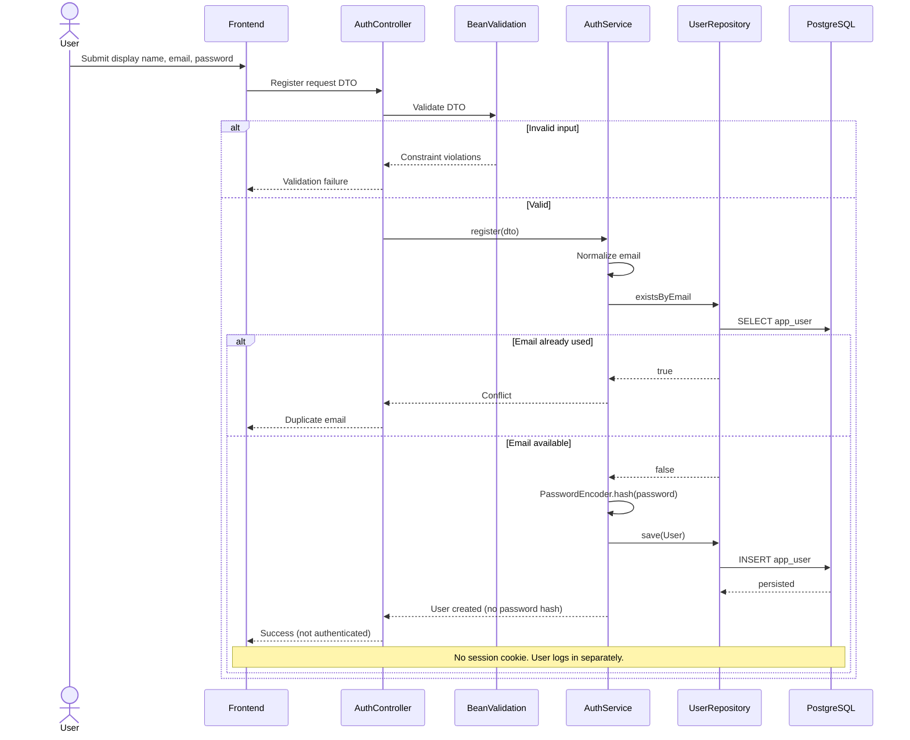

DB unique on `email` is a backstop if two registers race.

---

# 3. Login and Server-Side Session Establishment

Physical storage of the servlet/Spring session (in-memory vs Spring Session JDBC) is **not decided** in the application schema and is **not shown** as a domain table.

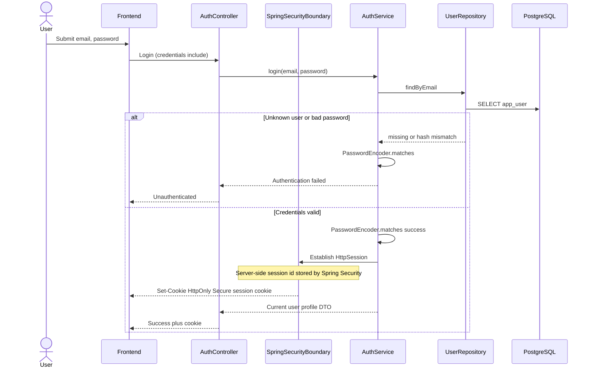

Later API calls send the cookie with `credentials: 'include'`. Logout invalidates the **server** session. Workout rows in PostgreSQL are unchanged.

---

# 4. Start Workout from Routine

Authenticated. Cookie omitted after this section unless security is the point.

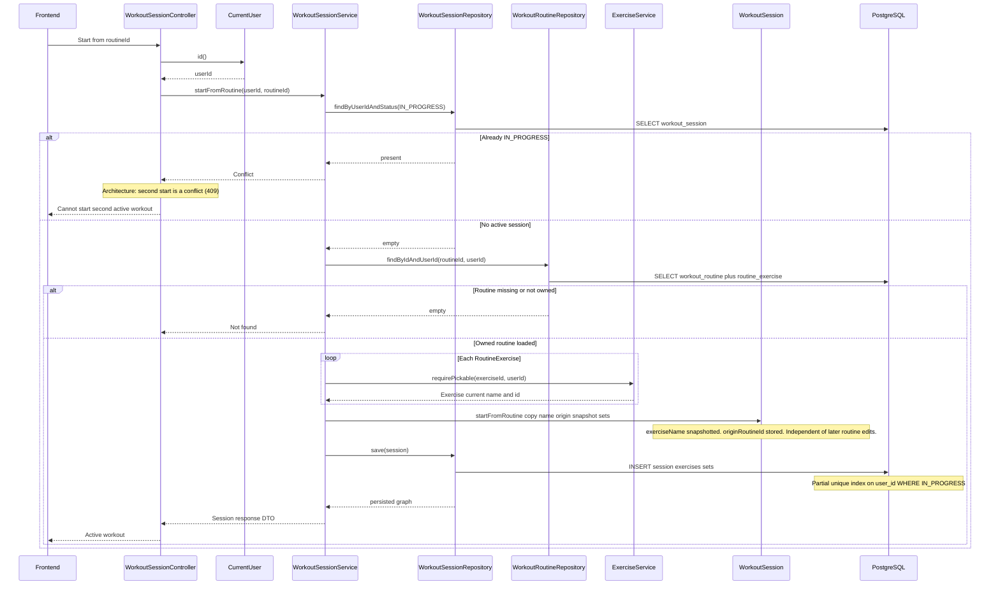

After this point, editing or deleting the **routine** does not rewrite the session graph. Completing later stores this copy as history (`COMPLETED`), still independent of the template.

---

# 5. Start Empty Workout

No routine load, no planned-set copy, `originRoutineId` null. Name comes from the request. Exercises may be added later.

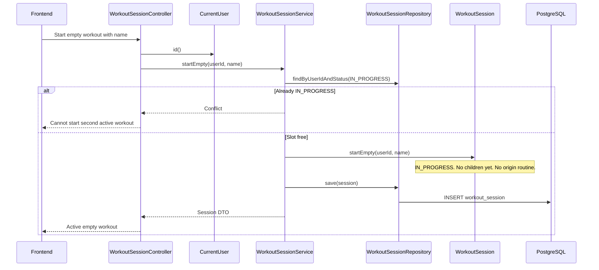

---

# 6. Resume Active Workout

Product: in-progress sessions are persisted and resumable. If none exists, **start** is the path (HLD). No approved “create empty session on GET.” This sequence returns **absence** of an active session; it does not invent an HTTP body shape.

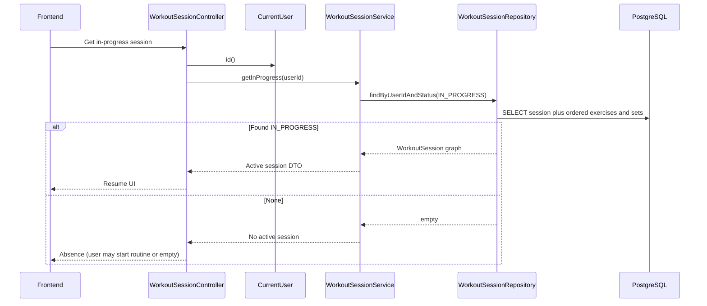

Unauthenticated callers never reach the service (`CurrentUser` / security filter → 401).

---

# 7. Log or Update a Workout Set

One representative mutation (weight/reps and optional mark completed). Add/remove set or exercise follows the same **owner + IN_PROGRESS** gate.

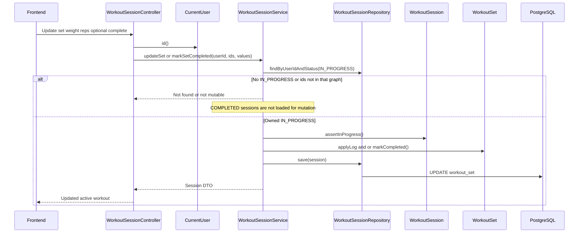

A `COMPLETED` session is only read via `WorkoutHistoryService` or deleted as a history item — **not** updated here.

---

# 8. Complete Workout

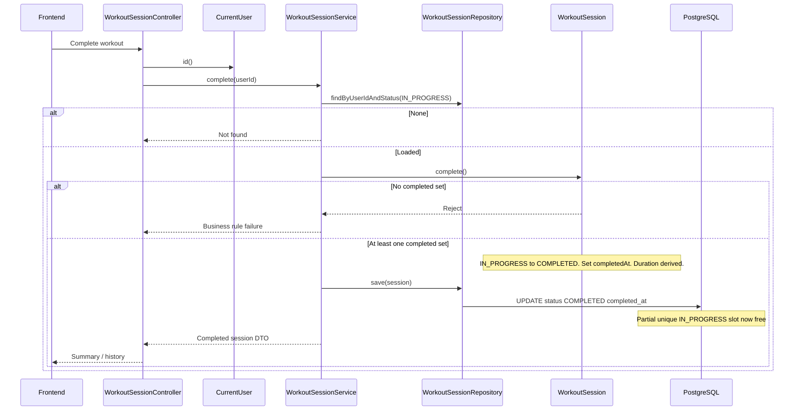

After `COMPLETED`, routine and `Exercise` updates do not rewrite this graph. History lists this row; logging APIs refuse mutation.

---

# 9. Discard Active Workout

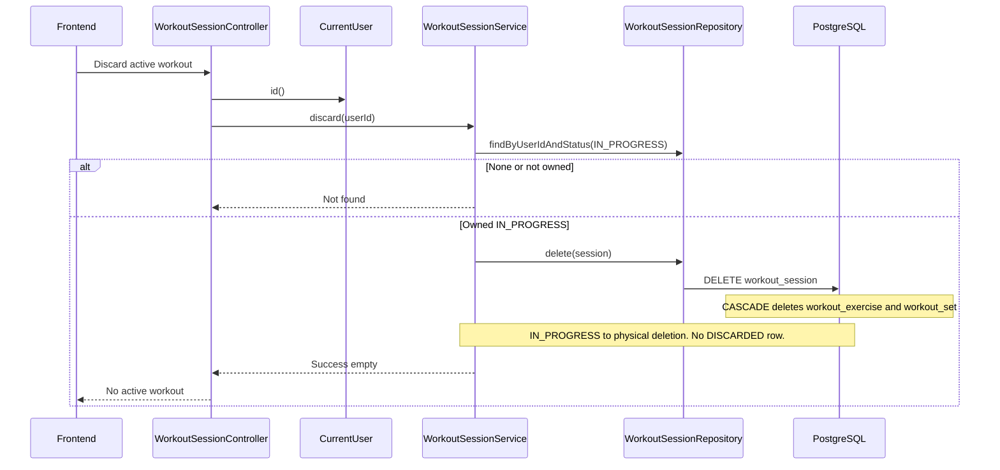

Not restorable. Not in history. Completing after discard is impossible.

---

# 10. Previous Performance Lookup

Called from the active-workout UI. Implementation lives on `WorkoutHistoryService` (class-diagram). Archived custom exercises still have `exercise.id`; snapshots keep historical **names**.

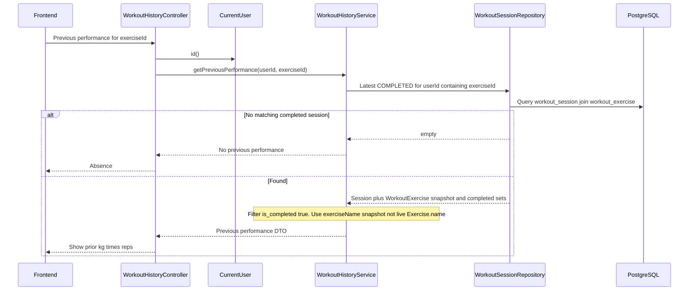

Only `userId` from `CurrentUser`. Another user’s completed sessions are never queried. Archive of the catalog row does not remove these `COMPLETED` rows.

---

# 11. Authorization and Cross-User Access Pattern

Representative: fetch or update another user’s **routine** (same pattern for custom exercise and session: `findByIdAndUserId` / `findByIdAndCreatedByUserId`).

Class design: empty owner-scoped lookup → **not found** (do not leak that the id exists). Exact HTTP mapping is not a full API contract here.

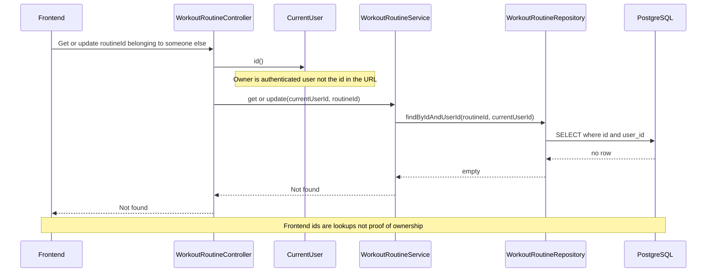

Security filter already rejected missing cookies (401) before this. Custom exercise mutate uses owner id on `Exercise`. Session mutate uses `IN_PROGRESS` + `userId`.

---

# 12. Concurrency / One Active Workout Consideration

Two overlapping **start** calls for the same user. No retry loop is specified; the losing attempt fails.

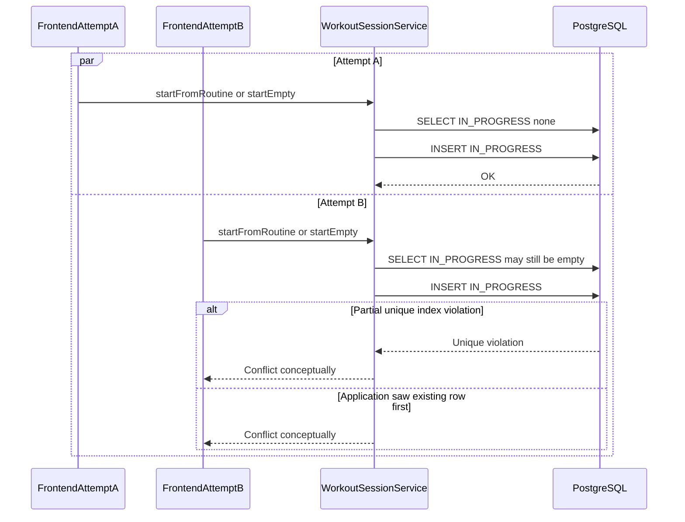

**Application check** avoids most collisions and yields a clear conflict. **PostgreSQL** `UNIQUE (user_id) WHERE status = 'IN_PROGRESS'` is the integrity guarantee if both checks pass. The winner has the only `IN_PROGRESS` row; the loser does not create a second active workout. UX copy for resume vs discard is product-open and not shown.

---

# 13. Consistency with Other Architecture Documents

| Sequence flow | Class-diagram components | Database components | Key architecture decision |
| --- | --- | --- | --- |
| Registration | `AuthController`, `AuthService`, `User`, `UserRepository` | `app_user` | Email/password account; no JWT; no auto-session unless later specified |
| Login | `AuthService`, `UserRepository`, Spring Security boundary, `CurrentUser` | `app_user` (lookup only) | ADR-006 HTTP-only server-side session cookie |
| Start from routine | `WorkoutSessionService`, `WorkoutRoutineRepository`, `ExerciseService`, `WorkoutSession` aggregate | `workout_session`, `workout_exercise` (snapshot), `workout_set`, `workout_routine` read | ADR-005 copy at start; one `IN_PROGRESS` (partial unique) |
| Start empty | `WorkoutSessionService`, `WorkoutSession` | `workout_session` only at insert | Same one-active rule; no origin routine |
| Resume | `WorkoutSessionService`, `WorkoutSessionRepository` | `workout_session` + children `IN_PROGRESS` | Server is source of truth (ADR-003) |
| Log set | `WorkoutSessionService`, `WorkoutSession.assertInProgress`, `WorkoutSet` | `workout_set` | Completed sessions not mutated |
| Complete | `WorkoutSession.complete`, `WorkoutSessionRepository.save` | status `COMPLETED`, `completed_at` | Lifecycle `IN_PROGRESS` → `COMPLETED` |
| Discard | `WorkoutSessionService.discard`, `delete` | `DELETE` session CASCADE children | ADR-007 physical delete; no `DISCARDED` |
| Previous performance | `WorkoutHistoryService`, `WorkoutSessionRepository` | `COMPLETED` + `exercise_id` + `is_completed` | Decision 18; snapshot name |
| Cross-user | `findByIdAndUserId`, `CurrentUser` | owner columns | HLD / class-diagram: not found, not frontend AuthZ |
| Concurrent start | service check + DB unique | partial unique index | database-design.md §7 / §9 |

---

# 14. Assumptions and Open Questions

**Assumptions (not new product rules):**

- Register does **not** create an HTTP session.
- Resume GET with no row returns **absence**, not an auto-created session.
- Other-user access is treated as **not found** (class-diagram).
- CSRF is configured for cookie auth but omitted from diagrams.
- Previous performance may be served by `WorkoutHistoryController` or nested in the session payload; both call `WorkoutHistoryService`.

| Question | Classification | Notes |
| --- | --- | --- |
| Auto-login immediately after register | NON-BLOCKING | Not required; §2 does not do it. HLD auth paragraph is combined signup/login wording. |
| Exact empty-resume representation | NON-BLOCKING | Absence vs explicit empty DTO is API design later |
| 404 vs 403 for other-user ids | NON-BLOCKING | Class-diagram prefers not-found; not a full error catalog |
| In-memory vs JDBC HTTP session store | DEFERRED | Outside application schema (ADR-006) |
| Collision UX copy | NON-BLOCKING | Product open; API conflict is specified |
| Default sets when adding exercise to empty session | NON-BLOCKING | Schema allows N rows; not this document |

No **BLOCKING** interaction questions. ADRs are not reopened.

---

# Final Self-Review

| Check | Result |
| --- | --- |
| class-diagram.md names | Controllers, services, repositories, `CurrentUser`, aggregates as specified |
| No JWT / access / refresh | Login uses HTTP-only session cookie only |
| Session states | `IN_PROGRESS` / `COMPLETED`; discard = delete |
| One active workout | Service check + partial unique index |
| History isolation | Snapshots at start; complete does not rewrite from catalog |
| Ownership | `CurrentUser` + owner-scoped repos |
| Previous performance | Current user + `exerciseId` + completed sets + snapshot name |
| No full API catalog | Flows only; 409/404 named only where architecture already did |
| No code/SQL | Diagrams and prose only |

**Ambiguity called out, not silently decided:** registration does not auto-authenticate; empty resume is “no active session” without a prescribed JSON shape.
