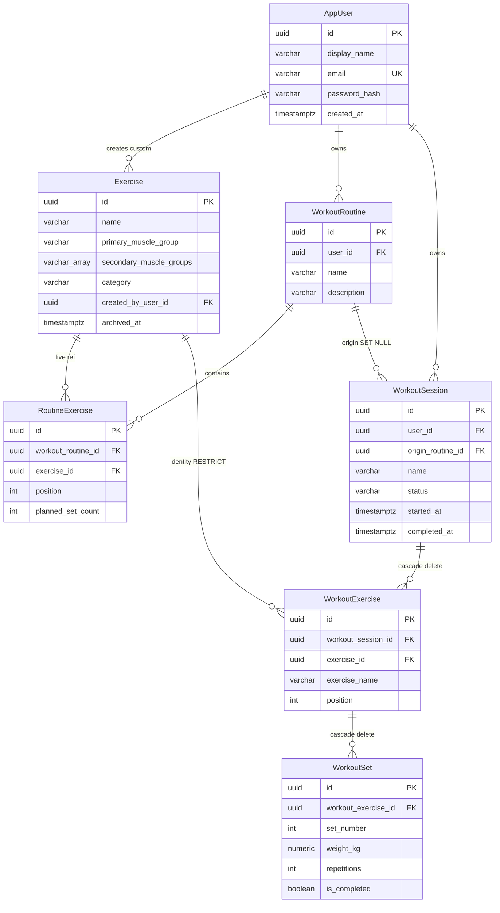

# Workout Tracker — Logical Database Design (MVP)

**Status:** Logical PostgreSQL model for the approved MVP.  
**Not in this document:** Flyway SQL, JPA entities, repositories, or executable `CREATE TABLE` statements.

**Precedence:** `docs/product/mvp-decisions.md` overrides `feature.md`. `docs/architecture/architecture-decisions.md` is the latest accepted architecture (ADR-001 through ADR-007).

**Explicit exclusions:**

- No JWT, access-token, refresh-token, or token-revocation tables.
- No Spring Security / servlet session persistence tables in this application schema. HTTP-only server-side sessions (ADR-006) may use in-memory sessions or, later, Spring Session JDBC as **framework** tables outside this design.
- No `DISCARDED` workout session status. Discard is physical deletion of the session aggregate (ADR-007).

---

# 1. Database Design Goals

This schema stores the MVP write model in **PostgreSQL** as a **normalized relational** design that a solo developer can implement with Flyway and JPA.

**Goals:**

- **Normalized relational design** — users, exercises, routines, sessions, session exercises, and sets are separate tables with explicit foreign keys. Unrelated data is not stored as JSON blobs.
- **Practical MVP simplicity** — one catalog table for system and custom exercises; no extra stores; no deferred-feature columns (notes, RPE, rest timer, PRs, volume, units).
- **Historical data preservation** — completed sessions keep a **snapshotted exercise name** (minimum) and logged sets. Routine edits and catalog edits do not rewrite those rows.
- **User data ownership** — every routine, session, and custom exercise is owned by `app_user.id`. Queries for those resources always include owner scope.
- **One persisted active workout** — at most one `workout_session` row per user with status `IN_PROGRESS`, enforced in PostgreSQL.
- **Physical deletion of discarded in-progress workouts** — discard deletes the session and its child exercises and sets. No discarded row remains.
- **No unnecessary authentication tables** — application schema stores only the user account (including password hash). Session cookies are Spring Security’s concern, not this model.

**Persisted session lifecycle:** `IN_PROGRESS` → `COMPLETED` only.

**Duration:** not stored. Completed duration is `completed_at - started_at`.

---

# 2. Entity Overview

| Table | Purpose | Ownership | Lifecycle | Key relationships |
| --- | --- | --- | --- | --- |
| `app_user` | Account: display name, email, password hash | Self | Created at signup; no product account-deletion | Parent of custom exercises, routines, sessions |
| `exercise` | Global catalog and user custom movements | System: none (`created_by_user_id` null). Custom: creating user | Custom: create/edit; archive hides from pickers. System: seed; not user-editable | Referenced by `routine_exercise` and `workout_exercise` |
| `workout_routine` | Reusable template | Owning user | Create/edit/delete | Has many `routine_exercise`; optional origin of `workout_session` |
| `routine_exercise` | Exercise slot on a routine | Via parent routine | Created/updated/deleted with the routine | Belongs to routine; references `exercise` |
| `workout_session` | Logged workout (active or completed) | Owning user | `IN_PROGRESS` or `COMPLETED`. Discard = hard delete | Optional FK to routine (`ON DELETE SET NULL`); has many `workout_exercise` |
| `workout_exercise` | Exercise block on a session, with name snapshot | Via parent session | Mutable while session `IN_PROGRESS`; frozen when `COMPLETED`; deleted with session on discard or history delete | Belongs to session; optional-stable FK to `exercise`; has many `workout_set` |
| `workout_set` | One set: weight (kg), reps, completed flag | Via parent session exercise | Mutable while session `IN_PROGRESS`; frozen when `COMPLETED`; deleted with parent | Belongs to `workout_exercise` |

Seven application tables. No auth-session, token, notes, PR, or settings tables.

---

# 3. Detailed Table Design

Conventions:

- Primary keys: `UUID`.
- Timestamps: `TIMESTAMPTZ`.
- Weight unit: kilograms only (`NUMERIC`); no unit column.

## 3.1 `app_user`

**Purpose:** Authenticated account. Password hash is persistence only, never an API field.

| Column | Type | Null | Notes |
| --- | --- | --- | --- |
| `id` | `UUID` | NOT NULL | PK |
| `display_name` | `VARCHAR(100)` | NOT NULL | Required at signup |
| `email` | `VARCHAR(320)` | NOT NULL | Login identifier; store normalized (application lowercases) |
| `password_hash` | `VARCHAR(255)` | NOT NULL | Slow hash (e.g. BCrypt); never returned by APIs |
| `created_at` | `TIMESTAMPTZ` | NOT NULL | Default `now()` |
| `updated_at` | `TIMESTAMPTZ` | NOT NULL | Default `now()` |

- **PK:** `id`
- **FK:** none
- **Unique:** `email`
- **Check:** none beyond NOT NULL
- **Defaults:** `created_at`, `updated_at` = `now()`

## 3.2 `exercise`

**Purpose:** One catalog of system-provided and user-created exercises.

| Column | Type | Null | Notes |
| --- | --- | --- | --- |
| `id` | `UUID` | NOT NULL | PK; stable identity for previous performance |
| `name` | `VARCHAR(200)` | NOT NULL | Current name; not the historical display source for sessions |
| `primary_muscle_group` | `VARCHAR(50)` | NOT NULL | Current classification |
| `secondary_muscle_groups` | `VARCHAR(50)[]` | NOT NULL | Default empty array `{}` |
| `category` | `VARCHAR(50)` | NOT NULL | Current category (e.g. Barbell); no closed enum in product |
| `created_by_user_id` | `UUID` | NULL | NULL = system/global; NOT NULL = custom owner |
| `archived_at` | `TIMESTAMPTZ` | NULL | Set when custom exercise is hidden from future selection |
| `created_at` | `TIMESTAMPTZ` | NOT NULL | Default `now()` |
| `updated_at` | `TIMESTAMPTZ` | NOT NULL | Default `now()` |

- **PK:** `id`
- **FK:** `created_by_user_id` → `app_user.id` **ON DELETE RESTRICT**
- **Unique:** none on name (product did not require unique names)
- **Check:**
  - `archived_at IS NULL OR created_by_user_id IS NOT NULL` (system exercises cannot be archived)
- **Defaults:** `secondary_muscle_groups = '{}'`; timestamps `now()`

System vs custom is derived: `created_by_user_id IS NULL` ⇒ system.

## 3.3 `workout_routine`

**Purpose:** Current reusable template. Not a history record.

| Column | Type | Null | Notes |
| --- | --- | --- | --- |
| `id` | `UUID` | NOT NULL | PK |
| `user_id` | `UUID` | NOT NULL | Owner |
| `name` | `VARCHAR(200)` | NOT NULL | Current template name |
| `description` | `VARCHAR(2000)` | NULL | Optional |
| `created_at` | `TIMESTAMPTZ` | NOT NULL | Default `now()` |
| `updated_at` | `TIMESTAMPTZ` | NOT NULL | Default `now()` |

- **PK:** `id`
- **FK:** `user_id` → `app_user.id` **ON DELETE RESTRICT**
- **Unique:** none required
- **Check:** none beyond NOT NULL
- **Defaults:** timestamps `now()`

## 3.4 `routine_exercise`

**Purpose:** Ordered slot on a routine with planned set count only (no target weight/reps).

| Column | Type | Null | Notes |
| --- | --- | --- | --- |
| `id` | `UUID` | NOT NULL | PK |
| `workout_routine_id` | `UUID` | NOT NULL | Parent routine |
| `exercise_id` | `UUID` | NOT NULL | Live catalog/custom reference |
| `position` | `INTEGER` | NOT NULL | Display/start order; 1-based |
| `planned_set_count` | `INTEGER` | NOT NULL | Required; used when starting a session from this routine |
| `created_at` | `TIMESTAMPTZ` | NOT NULL | Default `now()` |

- **PK:** `id`
- **FK:**
  - `workout_routine_id` → `workout_routine.id` **ON DELETE CASCADE**
  - `exercise_id` → `exercise.id` **ON DELETE RESTRICT**
- **Unique:**
  - `(workout_routine_id, exercise_id)` — same exercise at most once per routine
  - `(workout_routine_id, position)` — unique order within a routine
- **Check:** `position >= 1`; `planned_set_count >= 1`
- **Defaults:** `created_at = now()`

## 3.5 `workout_session`

**Purpose:** One logged workout. Source of truth for resume, complete, and history.

| Column | Type | Null | Notes |
| --- | --- | --- | --- |
| `id` | `UUID` | NOT NULL | PK |
| `user_id` | `UUID` | NOT NULL | Owner |
| `origin_routine_id` | `UUID` | NULL | Traceability only; not display source of truth |
| `name` | `VARCHAR(200)` | NOT NULL | Copied from routine or supplied for empty start; frozen for history |
| `status` | `VARCHAR(20)` | NOT NULL | `IN_PROGRESS` or `COMPLETED` only |
| `started_at` | `TIMESTAMPTZ` | NOT NULL | Set at start |
| `completed_at` | `TIMESTAMPTZ` | NULL | Set only when completing |
| `created_at` | `TIMESTAMPTZ` | NOT NULL | Default `now()` |
| `updated_at` | `TIMESTAMPTZ` | NOT NULL | Default `now()` |

No `duration` column. No `DISCARDED` value.

- **PK:** `id`
- **FK:**
  - `user_id` → `app_user.id` **ON DELETE RESTRICT**
  - `origin_routine_id` → `workout_routine.id` **ON DELETE SET NULL**
- **Unique:** **partial unique index** on `user_id` **WHERE `status = 'IN_PROGRESS'`** (exactly one in-progress session per user)
- **Check:**
  - `status IN ('IN_PROGRESS', 'COMPLETED')`
  - `(status = 'IN_PROGRESS' AND completed_at IS NULL) OR (status = 'COMPLETED' AND completed_at IS NOT NULL AND completed_at >= started_at)`
- **Defaults:** `status` has no implicit default in the model (application sets `IN_PROGRESS` on insert); timestamps `now()` for `created_at`/`updated_at`; `started_at` set explicitly at start

## 3.6 `workout_exercise`

**Purpose:** Exercise block on a session. Carries **historical display name** plus **stable exercise identity**.

| Column | Type | Null | Notes |
| --- | --- | --- | --- |
| `id` | `UUID` | NOT NULL | PK |
| `workout_session_id` | `UUID` | NOT NULL | Parent session |
| `exercise_id` | `UUID` | NOT NULL | Identity at add time; previous-performance grouping |
| `exercise_name` | `VARCHAR(200)` | NOT NULL | **Snapshot** of `exercise.name` when placed on the session |
| `position` | `INTEGER` | NOT NULL | Order in the session; 1-based |
| `created_at` | `TIMESTAMPTZ` | NOT NULL | Default `now()` |

Muscle group and category are **not** snapshotted: MVP history/details display name, sets, weight, and reps. Extra snapshot columns would be unused deferred metadata.

- **PK:** `id`
- **FK:**
  - `workout_session_id` → `workout_session.id` **ON DELETE CASCADE**
  - `exercise_id` → `exercise.id` **ON DELETE RESTRICT**
- **Unique:** `(workout_session_id, position)`
- **Not unique:** `(workout_session_id, exercise_id)` — product uniqueness is **routine-only**; the same exercise may appear twice on a **session**
- **Check:** `position >= 1`
- **Defaults:** `created_at = now()`

`ON DELETE RESTRICT` on `exercise_id` keeps identity for grouping. Archive does not delete the exercise row, so history FKs stay valid.

## 3.7 `workout_set`

**Purpose:** One set on a session exercise.

| Column | Type | Null | Notes |
| --- | --- | --- | --- |
| `id` | `UUID` | NOT NULL | PK |
| `workout_exercise_id` | `UUID` | NOT NULL | Parent block |
| `set_number` | `INTEGER` | NOT NULL | Order within the exercise; 1-based |
| `weight_kg` | `NUMERIC(8,2)` | NULL | kg; null until entered |
| `repetitions` | `INTEGER` | NULL | Null until entered |
| `is_completed` | `BOOLEAN` | NOT NULL | Completed workout data iff true |
| `created_at` | `TIMESTAMPTZ` | NOT NULL | Default `now()` |
| `updated_at` | `TIMESTAMPTZ` | NOT NULL | Default `now()` |

- **PK:** `id`
- **FK:** `workout_exercise_id` → `workout_exercise.id` **ON DELETE CASCADE**
- **Unique:** `(workout_exercise_id, set_number)`
- **Check:**
  - `set_number >= 1`
  - `weight_kg IS NULL OR weight_kg >= 0`
  - `repetitions IS NULL OR repetitions >= 0`
  - `NOT is_completed OR (weight_kg IS NOT NULL AND repetitions IS NOT NULL)` — a completed set must have values
- **Defaults:** `is_completed = false`; timestamps `now()`

Incomplete rows may remain after the session is completed; queries that mean “completed workout data” filter `is_completed = true`.

---

# 4. Relationship Design

```text
app_user 1 ──< exercise (custom only; system has no owner)
app_user 1 ──< workout_routine
app_user 1 ──< workout_session

workout_routine 1 ──< routine_exercise
exercise 1 ──< routine_exercise

workout_routine 0..1 ──< workout_session (origin; SET NULL on routine delete)

workout_session 1 ──< workout_exercise
exercise 1 ──< workout_exercise (identity + RESTRICT)
workout_exercise 1 ──< workout_set
```

### User → Custom Exercise

One user has many custom `exercise` rows (`created_by_user_id`). System rows have `created_by_user_id` null. Pickers load global rows plus the current user’s non-archived custom rows.

### User → Workout Routine

One user has many routines. All routine access is `workout_routine.user_id = current_user`.

### Workout Routine → Routine Exercise

One routine has many ordered slots. Deleting a **routine** cascades to `routine_exercise` only. It does **not** cascade to `workout_session`.

### User → Workout Session

One user has many sessions over time, but **at most one** with `status = IN_PROGRESS`. Completed sessions are history. Discard removes the in-progress row.

### Workout Session → Workout Exercise

One session has many exercise blocks. Deleting a **session** (discard of `IN_PROGRESS`, or user delete of a `COMPLETED` history record) cascades to `workout_exercise` and then `workout_set`.

### Workout Exercise → Workout Set

One block has many sets. Removing an exercise from an in-progress session deletes that `workout_exercise` and its sets (cascade).

### Workout Exercise vs mutable Exercise

`workout_exercise.exercise_id` is a **stable identity** for previous performance and for “this is the same movement.”  
`workout_exercise.exercise_name` is the **display snapshot**. History and details must read the snapshot, not `exercise.name`. Edits to `exercise` change future pickers and **new** snapshots only.

---

# 5. Exercise Lifecycle Strategy

| Kind | How identified | Who mutates | Archive | History |
| --- | --- | --- | --- | --- |
| **System** | `created_by_user_id IS NULL` | Application/seed only; users cannot update or archive | `archived_at` must stay null (check) | Sessions keep `exercise_id` + snapshotted name |
| **User-created** | `created_by_user_id = owner` | Owner create/edit | Owner sets `archived_at` | Same snapshot + FK; row remains |
| **Archived custom** | `archived_at IS NOT NULL` | Still owner’s row; hidden from pickers | Not a hard delete | FKs remain; name snapshot already stored |

**Users cannot modify global system exercises** — enforced in the **application** (no update API for system rows). Database does not use row-level security in MVP; services load system exercises as read-only.

**Users cannot access another user’s custom exercises** — picker and mutate queries: `created_by_user_id IS NULL OR created_by_user_id = :currentUserId`. Other users’ custom rows are not returned. Using another user’s `exercise_id` on a routine/session is rejected in the service (and would fail ownership checks). A custom exercise FK from another user’s routine is prevented because routines are user-scoped and only pickable ids are accepted.

**Archived exercises are hidden from normal selection** — picker: `archived_at IS NULL` plus ownership rule above. Existing `routine_exercise` rows that still point at an archived exercise: application should not offer that exercise for **new** adds; editing a routine that already contains it is an application concern (do not invent auto-strip). Sessions already snapshotted are unaffected.

**Historical sessions remain valid** — no hard delete of `exercise` in MVP; `ON DELETE RESTRICT` from `workout_exercise` and `routine_exercise`. Archive does not null FKs.

**Editing an exercise does not rewrite historical display** — display uses `workout_exercise.exercise_name` captured at add-to-session time.

---

# 6. Workout Routine Strategy

- **Ownership:** `workout_routine.user_id`. List/get/update/delete always include this predicate.
- **Ordering:** `routine_exercise.position` unique per routine. Application rewrites positions on reorder.
- **Planned set count:** `planned_set_count >= 1`, required. Used only when **starting** a session from the routine to insert that many incomplete `workout_set` rows. Not copied onto `workout_exercise` (actual sets are the record).
- **Exercise uniqueness:** unique `(workout_routine_id, exercise_id)`.
- **Routine deletion:** `DELETE workout_routine` cascades to `routine_exercise`. `workout_session.origin_routine_id` becomes **NULL**. Session `name`, exercises, snapshots, and sets are unchanged.
- **Future vs past:** Editing a routine changes the template for **later starts**. An already created `IN_PROGRESS` or `COMPLETED` session is a copy and is not updated.

---

# 7. Workout Session Lifecycle

Persisted states only:

```text
(start) → IN_PROGRESS → COMPLETED
              ↓
         physical delete (discard)
```

`DISCARDED` is **not** a column value and **not** a row that remains.

### Exactly one `IN_PROGRESS` session per user

**PostgreSQL:** unique partial index:

`UNIQUE (user_id) WHERE status = 'IN_PROGRESS'`

A second insert with `IN_PROGRESS` for the same user fails. After complete, status is `COMPLETED` and the index slot is free. After discard, the row is gone and the slot is free.

**Application:** reject start with 409 if an in-progress session exists (same rule; index is the backstop).

### Resume

`SELECT` the session for `user_id` and `status = 'IN_PROGRESS'`, then load child `workout_exercise` ordered by `position` and `workout_set` ordered by `set_number`. Same rows after refresh or another device.

### Completion

**Application:** session must be `IN_PROGRESS`; at least one `workout_set.is_completed = true` in the aggregate; then set `status = COMPLETED` and `completed_at = now()` (or request time). After that, services refuse mutations to sets/exercises (except deleting the whole completed session from history).

**Database:** check constraint requires `completed_at` when `COMPLETED`. Does **not** count completed sets (cross-table); that stays in the service.

### Timestamps

| Status | `started_at` | `completed_at` |
| --- | --- | --- |
| `IN_PROGRESS` | set at start | null |
| `COMPLETED` | unchanged | set at complete; `>= started_at` |

Live timer on the active screen is **not** a stored duration; the client may compute elapsed from `started_at`.

### Immutability of completed records

No status besides `IN_PROGRESS`/`COMPLETED`. Completed rows are not updated except `DELETE` of the entire session (history delete), which cascades children. Application must not UPDATE completed sets.

### Discard (`IN_PROGRESS` → physical deletion)

Authorized delete of **that user’s** `IN_PROGRESS` session:

1. Delete `workout_session` where `id = :id AND user_id = :currentUser AND status = 'IN_PROGRESS'`.
2. **ON DELETE CASCADE** removes `workout_exercise` then `workout_set`.
3. No row remains; cannot restore; not in history.

**Must not cascade from routine or exercise to completed history:**

| Parent delete | Child sessions |
| --- | --- |
| `workout_routine` | `origin_routine_id` **SET NULL**; sessions kept |
| `exercise` | **RESTRICT** if still referenced; archive instead of delete |
| `app_user` | **RESTRICT** (account deletion out of scope) |
| `workout_session` (discard or history delete) | Cascade to session exercises and sets **only** |

A routine delete therefore cannot pull completed sessions with it.

---

# 8. Historical Data and Snapshot Strategy

The **session graph** is the history record.

### Workout Routine → Workout Session (at start from routine)

| Copied onto session | Not copied / not a live join for history |
| --- | --- |
| `name` ← routine `name` | Later routine name changes |
| Child exercises in `position` order | Live `routine_exercise` list |
| For each exercise: create `planned_set_count` incomplete sets | Planned count itself (sets are enough) |
| `origin_routine_id` ← routine id (nullable later) | Using origin to load template for history display |

Empty start: user-supplied `name`; `origin_routine_id` null; no routine copy.

**After start, routine is not the source of truth** for the session.

### Exercise → Workout Exercise (when placed on a session)

Placement = start-from-routine copy **or** add during an in-progress session.

| Snapshot (stored) | FK reference (identity) |
| --- | --- |
| `exercise_name` ← current `exercise.name` (**required**, decision 30) | `exercise_id` ← `exercise.id` (**required** for grouping, decision 26) |
| `position` on the session | — |

Not snapshotted for MVP: primary/secondary muscle, category (not required for history/details display).

Completing the session **does not** re-read catalog names.

### Guarantees

| Event | Effect on completed (and already-copied in-progress) data |
| --- | --- |
| Routine edit | None |
| Routine delete | `origin_routine_id` null; `name` and children unchanged |
| Exercise rename/edit | `exercise_name` on old session blocks unchanged |
| Custom archive | Picker hides row; `exercise_id` still valid; snapshot name unchanged |
| Previous performance | Latest `COMPLETED` session for this `user_id` with `workout_exercise.exercise_id = :id`, then that block’s sets with `is_completed = true` |

---

# 9. Data Integrity Rules

### Database-enforced

| Rule | Mechanism |
| --- | --- |
| At most one `IN_PROGRESS` session per user | **Partial unique index** on `workout_session (user_id) WHERE status = 'IN_PROGRESS'` |
| Status only `IN_PROGRESS` / `COMPLETED` | `CHECK` on `status` |
| `completed_at` null iff in progress; set and `>= started_at` iff completed | `CHECK` on `workout_session` |
| Unique exercise per **routine** | `UNIQUE (workout_routine_id, exercise_id)` |
| Unique position per routine | `UNIQUE (workout_routine_id, position)` |
| Unique position per session | `UNIQUE (workout_session_id, position)` |
| Unique set number per session exercise | `UNIQUE (workout_exercise_id, set_number)` |
| `planned_set_count >= 1`, positions/set numbers `>= 1` | `CHECK` |
| Non-negative weight and reps when present | `CHECK` |
| Completed set has weight and reps | `CHECK` on `workout_set` |
| System exercises not archived | `CHECK` on `exercise` |
| Unique login email | `UNIQUE (email)` |
| FKs as specified | Including cascade/set null/restrict |

**Partial unique index (recommended):** PostgreSQL `CREATE UNIQUE INDEX ... ON workout_session (user_id) WHERE status = 'IN_PROGRESS'`. A full unique on `(user_id, status)` would incorrectly allow only one `COMPLETED` session per user. A unique on `user_id` would allow only one session ever. The **partial** index is the correct invariant.

### Application-enforced

| Rule | Why not (only) in the database |
| --- | --- |
| Complete workout requires ≥1 completed set | Cross-aggregate count; service transaction |
| Do not mutate sets/exercises when `COMPLETED` | Possible with triggers; service is simpler and sufficient |
| Only pickable exercises (global or own non-archived custom) on add | Cross-table + archive + ownership |
| Planned set count supplied by client (no magic default) | Product: required input |
| Unique exercise **not** required on a session | Product: routine-only |
| Reject starting a second session with a clear API error | Index will fail; service should check first for 409 |
| Password hashing / email normalize | Auth module |
| Users cannot PATCH system exercises | AuthZ in exercise service |
| History delete vs discard | Same cascade delete; service ensures discard only if `IN_PROGRESS`, history delete only if `COMPLETED` |
| Decimal vs integer kg policy beyond `NUMERIC` and `>= 0` | Product left finer limits unspecified |

Do not encode “week” dashboard stats, PR formulas, or muscle-filter primary-vs-secondary matching as constraints.

---

# 10. Indexing Strategy

Besides PKs and unique constraints (which create indexes):

| Index | Supports |
| --- | --- |
| `app_user (email)` unique | Login |
| `exercise (created_by_user_id)` | List current user’s custom exercises |
| `exercise (archived_at)` or filtered `(created_by_user_id) WHERE archived_at IS NULL` | Picker: non-archived custom + all system (system queried by `created_by_user_id IS NULL`) |
| `exercise (primary_muscle_group)` | Filter catalog by muscle group |
| `workout_routine (user_id)` | User’s routine list |
| `routine_exercise (workout_routine_id, position)` | Load routine in order (unique already covers this) |
| **Partial unique** `workout_session (user_id) WHERE status = 'IN_PROGRESS'` | One active session; resume lookup by user |
| `workout_session (user_id, completed_at DESC) WHERE status = 'COMPLETED'` | History reverse chronological; “most recent workout” |
| `workout_exercise (workout_session_id, position)` | Load session graph in order (unique covers) |
| `workout_exercise (exercise_id, workout_session_id)` | Previous performance: sessions containing this exercise |
| `workout_set (workout_exercise_id, set_number)` | Set order (unique covers) |

**Previous performance access path:** filter `workout_session` by `user_id` + `COMPLETED`, join `workout_exercise` on `exercise_id`, order by `completed_at DESC`, take latest session, then completed sets. The pair of history index + `(exercise_id, workout_session_id)` is enough at MVP scale.

Avoid: trigram indexes until search volume requires them; extra indexes on `name` for every table; indexes solely for deferred charts/PRs.

---

# 11. Delete and Archive Strategy

| Entity | Strategy | Why |
| --- | --- | --- |
| **Users** | **Restrict** FKs; **no product delete**. DBA/manual delete is blocked while children exist | Account deletion is out of scope; do not cascade-erase history as an implied feature |
| **System exercises** | **No user delete**; **RESTRICT** if referenced | Catalog identity for grouping; seed-owned |
| **Custom exercises** | **Archive** (`archived_at`); **not** hard delete | Hide from future selection; keep FKs and snapshots |
| **Workout routines** | **Hard delete**; cascade `routine_exercise` only; sessions **SET NULL** origin | Product: delete templates without wiping history |
| **Routine exercises** | Cascade from routine; or delete row on routine edit | Template slots only |
| **Workout sessions (`IN_PROGRESS`)** | Discard = **hard delete** session; cascade children | ADR-007 |
| **Workout sessions (`COMPLETED`)** | User **hard delete** history record; cascade children | Explicit history delete; not a side effect of routine/exercise change |
| **Workout exercises / sets** | Cascade from session; cascade from exercise-block remove during `IN_PROGRESS` | Session aggregate |

### Four cases called out

1. **Deleting a routine** — must **not** delete completed history. `ON DELETE SET NULL` on `origin_routine_id`. No cascade from routine to session.
2. **Archiving a custom exercise** — update `archived_at`; **no** delete of `exercise`; session FKs remain.
3. **Discarding `IN_PROGRESS`** — `DELETE` that session; cascade `workout_exercise` and `workout_set`. Status is never `DISCARDED`.
4. **Deleting a user** — **not implemented**. Recommended MVP: **RESTRICT** so a stray `DELETE FROM app_user` cannot silently destroy data. If account deletion is added later, it needs an explicit product + ADR (what happens to history).

Completed-session delete and in-progress discard share cascade mechanics; the service distinguishes which status may be deleted for which API.

---

# 12. ER Diagram



---

# 13. Key Data Flows

### 1. Create a routine

Insert `workout_routine` (`user_id` = current user). Insert `routine_exercise` rows with distinct `exercise_id`, `position`, `planned_set_count`. Exercises must be pickable (service). Unique constraints reject duplicate exercise or position.

### 2. Start a workout from a routine

If partial unique index would conflict, abort. Insert `workout_session`: `status = IN_PROGRESS`, `started_at = now()`, `completed_at` null, `name` = routine name, `origin_routine_id` = routine id. For each `routine_exercise` in position order: insert `workout_exercise` with `exercise_id` and `exercise_name` copied from `exercise`; insert `planned_set_count` `workout_set` rows (`is_completed = false`, null weight/reps, `set_number` 1..n).

### 3. Start an empty workout

Same session insert without origin; `name` from request; no child exercises until the user adds them. Adding an exercise snapshots name and creates sets as the application defines (count is not a routine planned count).

### 4. Resume an `IN_PROGRESS` workout

Select session by `user_id` and `status = IN_PROGRESS`. Join children by `position` / `set_number`.

### 5. Log a set

Update `workout_set` on a session that is `IN_PROGRESS` and owned by the user: weight, reps, `is_completed`. Add/remove set rows; keep `set_number` unique. Remove exercise = delete `workout_exercise` (cascade sets).

### 6. Complete a workout

Service verifies ≥1 completed set. Update session to `COMPLETED` and set `completed_at`. Incomplete set rows remain; history/previous-performance queries ignore `is_completed = false`.

### 7. Discard an `IN_PROGRESS` workout

`DELETE` the owned `IN_PROGRESS` session. Cascade deletes exercises and sets. No leftover status row.

### 8. Query workout history

`workout_session` where `user_id = :id AND status = 'COMPLETED'` order by `completed_at DESC`. Detail: children + snapshot names; prefer completed sets for “completed workout data.” Optional `DELETE` of that session (cascade children).

### 9. Query previous performance

Among `COMPLETED` sessions for the user that have `workout_exercise.exercise_id = :exerciseId`, pick the one with max `completed_at`. Return that block’s sets where `is_completed = true`. Do not use live `exercise.name` for the comparison payload’s historical label if showing the past session’s name—use the snapshot on that block.

---

# 14. Security and Data Ownership

Spring Security supplies the authenticated **user id** from the HTTP-only session cookie. This schema does not store that cookie. Repositories and services must still **scope by owner**.

| Resource | Scope |
| --- | --- |
| Routines | `workout_routine.user_id = :currentUserId` |
| Sessions (active and history) | `workout_session.user_id = :currentUserId` |
| Custom exercises | `exercise.created_by_user_id = :currentUserId` |
| System exercises | Readable by any authenticated user; `created_by_user_id IS NULL` |
| Child rows | Load via owned parent (session/routine), never by child id alone without joining owner |

**Pattern:** `findByIdAndUserId`. Missing and other-user ids look the same (not found). Do not authorize only in the SPA.

Password hashes never appear in queries returned to the client.

No JWT tables; no session-id columns on `app_user` for cookie sessions.

---

# 15. Future Schema Evolution

Do **not** add these columns/tables for MVP. Possible later, same PostgreSQL:

| Feature | Likely evolution |
| --- | --- |
| Personal records | Table computed on complete, or query over `workout_set` where `is_completed` |
| Progress charts | Aggregations on completed sets by `exercise_id` and `completed_at`; no new write model required at first |
| Rest timer | Client-only, or later `app_user.default_rest_seconds` |
| Notes | `workout_exercise.notes` / `workout_session.notes` (P2) |
| RPE | `workout_set.rpe` |
| Supersets | Grouping table or `superset_group_id` on `workout_exercise` |

Existing session graph and `exercise_id` snapshots are enough for charts/PRs to **read** later without redesigning history.

---

# 16. Assumptions and Open Questions

### Assumptions (not new product features)

- Email uniqueness and stored password hash are required for email/password login.
- UUID primary keys.
- `NUMERIC` weight allows values such as 2.5 kg without inventing a plate-increment product rule.
- Spring Session JDBC tables are **out of this document** even if chosen at deployment; they are not application domain tables.
- `exercise_id` on `workout_exercise` is always set because MVP adds only catalog or custom exercises (no free-text-only movements).
- Muscle/category are not snapshotted because MVP history display does not require them.

### Open questions

| Question | Classification | Notes |
| --- | --- | --- |
| Default number of sets when adding an exercise to an **empty** in-progress session | NON-BLOCKING | Planned count exists only on routines. Application may require an explicit count or insert one empty set; product did not specify. Schema allows any number of `workout_set` rows. |
| Muscle-group filter matches primary only vs primary or secondary | NON-BLOCKING | Both columns exist; query predicate is application/API. |
| Whether incomplete set rows are deleted at complete time | NON-BLOCKING | Schema keeps them; queries filter `is_completed`. Product did not require delete. |
| Catalog seed contents | NON-BLOCKING | Data, not structure. |
| Password complexity | NON-BLOCKING | Not a schema concern beyond `password_hash` length. |
| Dashboard “this week” timezone | NON-BLOCKING | Use `completed_at`; no week column. |
| Progress screen / best-weight table | DEFERRED / NON-BLOCKING | No extra tables. |
| Rest timer, PRs, notes, RPE, supersets, streak | DEFERRED | No schema now. |
| Account deletion cascade vs retain | DEFERRED | Product out of scope; FKs RESTRICT. |

No **BLOCKING** database questions remain for this logical model. ADR-006 and ADR-007 are not reopened.

---

# Final Self-Review

| Check | Result |
| --- | --- |
| P0 (auth account, routines, catalog/custom archive, session log, previous performance, history, snapshots, one in-progress) | Supported |
| Completed history preserved | Session graph + `exercise_name` snapshot; routine not live-joined |
| One `IN_PROGRESS` per user | Partial unique index |
| Lifecycle only `IN_PROGRESS` / `COMPLETED` | Check constraint; no `DISCARDED` |
| Discard physically deletes session + children | `ON DELETE CASCADE` from session |
| Routine delete cannot break history | `ON DELETE SET NULL` on origin |
| Exercise edits cannot corrupt display | Snapshot name; FK identity only |
| System vs custom ownership | `created_by_user_id` null vs set; archive check |
| Previous performance | Index path on user + completed + `exercise_id` |
| No JWT/token tables | None |
| No Spring Security session tables in this schema | Explicitly excluded |
| No deferred feature tables | None |
| Normalized PostgreSQL | Seven tables, explicit FKs |
| No executable SQL or Java | Logical design only |

**No unsupported P0 requirement identified.** Duration is derived, not stored. Auth cookie storage is outside this schema by accepted architecture.
