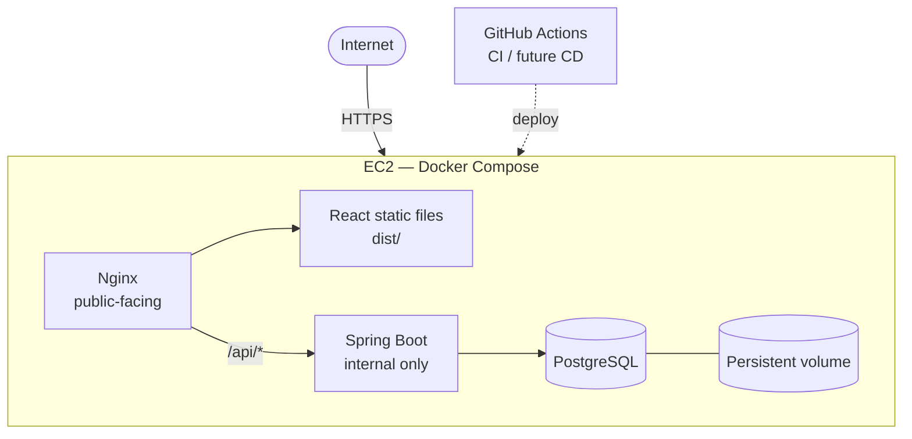

# Deployment Architecture

This document describes the **finalized deployment architecture** for the Workout Tracker MVP, what is **already implemented in the repository**, and what is **planned for AWS production**.

**Pricing note:** AWS costs change frequently. Treat cost discussion as qualitative guidance and verify current pricing before provisioning resources.

---

## Document status

| Area | Status |
|------|--------|
| Backend Dockerfile, frontend build, root `compose.yaml` | **Implemented** (Phase D1) |
| GitHub Actions CI (test, build, Docker validation) | **Implemented** (no deployment yet) |
| Nginx reverse proxy for `/api/*` on a single origin | **Implemented** (Phase B15) |
| Same-origin Docker Compose (`nginx` + `backend` + `postgres`) | **Implemented** (Phase B15) |
| EC2 production deployment | **Planned** (Phases B17–B18) |
| HTTPS + custom domain | **Planned** (Phase B19) |
| Automated CD to EC2 | **Planned** (Phase B20) |
| AWS resources (EC2 instance, domain, TLS) | **Not deployed yet** |

---

## Architecture decision

For the initial production deployment, this project uses a **single AWS EC2 instance** running **Docker Compose**. **Nginx** serves the React frontend and reverse-proxies `/api` requests to the **Spring Boot** backend. **PostgreSQL** runs as another Docker Compose service with **persistent storage**.

This architecture is intentionally simple and cost-conscious for the expected small user base (fewer than 30 users), while providing hands-on learning in Linux, EC2, Docker, Docker Compose, Nginx, reverse proxies, networking, CI/CD, security groups, environment configuration, and database operations.

The architecture can later evolve to managed services such as RDS, ECR, ECS/Fargate, or CloudFront if scale, reliability, operational requirements, or learning goals justify the added complexity. Those are **future alternatives only** — not the current plan.

---

## 1. Architecture overview

### Target production architecture (finalized)

The initial production deployment is intentionally simple:

- One **AWS EC2** instance
- **Docker** and **Docker Compose**
- **Nginx** as the single public-facing service
- **React/Vite** static frontend (built to `dist/`, served by Nginx)
- **Spring Boot** backend (container, internal network only)
- **PostgreSQL** (container, internal network only, persistent volume)
- **GitHub Actions** for CI (and later CD)



### Same-origin production model

The browser communicates with **Nginx only**:

```
https://workout.example.com/          → React static files
https://workout.example.com/api/...   → Spring Boot (via Nginx proxy)
```

Do **not** use separate frontend and API domains as the primary architecture. Same-origin deployment aligns with the application’s session cookies, CSRF, and `credentials: 'include'` model.

### Application constraints (existing implementation)

The application uses:

- **Session cookies** (`JSESSIONID`, HTTP-only) for authentication — not JWT
- **CSRF** (`X-XSRF-TOKEN` header; token from `GET /api/auth/csrf`)
- **CORS with credentials** when frontend and API origins differ
- **PostgreSQL** with **Flyway** migrations (`ddl-auto=validate`)
- **Request correlation** via `X-Request-Id` (MDC logging)
- **Health endpoint** at `GET /actuator/health` (public, no session required)

Same-origin production reduces unnecessary CORS and cross-site cookie complexity compared to split-domain deployments.

---

## 2. Request flow

### Production request flow (target)

**Frontend (static assets):**

```
Browser → Nginx → React static files (dist/)
```

**API:**

```
Browser → Nginx → /api/* → Spring Boot container → PostgreSQL container
```

**SPA client-side routes:**

```
Browser → Nginx → try_files fallback → index.html (React Router)
```

### Network boundaries (production)

| Component | Public internet | Notes |
|-----------|-----------------|-------|
| **Nginx** | Yes | Only public-facing application service |
| **Spring Boot** | **No** | Reachable only on Docker Compose network (e.g. `backend:8080`) |
| **PostgreSQL** | **No** | Reachable only by backend on Compose network (e.g. `postgres:5432`) |

- Nginx and Spring Boot communicate over the **Docker Compose network** using the backend **service name** — not `localhost`.
- Spring Boot and PostgreSQL communicate over the **Docker Compose network** using the postgres **service name** — not `localhost`.

---

## 3. Frontend

### Build pipeline

```
React/Vite
    ↓
npm run build
    ↓
dist/
    ↓
Nginx (serves static files)
```

The repository already supports production builds via `npm run build` (TypeScript compile + Vite). Output is written to `frontend/dist/`.

### API base URL configuration

Configured at **build time** through `VITE_API_BASE_URL` (see `frontend/src/lib/env.ts`).

| Environment | `VITE_API_BASE_URL` | Request path |
|-------------|---------------------|--------------|
| **Local dev** (Vite dev server) | `http://localhost:8080/api` | Browser → backend directly |
| **Production** (same-origin) | `/api` | Browser → Nginx → `/api/*` → Spring Boot |

**Why `/api` in production:**

```
Development:
  Frontend (localhost:5173) → http://localhost:8080/api

Production:
  Frontend (https://workout.example.com) → /api
                                              ↓
                                            Nginx
                                              ↓
                                         Spring Boot
```

Relative `/api` keeps all browser requests on **one origin**, which simplifies session cookies and CSRF.

### SPA routing

Nginx must support React Router by falling back to the SPA entry point for non-file routes.

The repository’s current `frontend/nginx.conf` already includes:

```nginx
location / {
    try_files $uri $uri/ /index.html;
}
```

Production Nginx configuration in `frontend/nginx.conf` proxies `/api/*`, `/swagger-ui`, `/v3/api-docs`, and `/actuator/` to the `backend` Compose service.

---

## 4. Nginx

Nginx is the **reverse proxy** and **frontend web server** in the target production architecture.

### Responsibilities

1. Serve React static files from `dist/`.
2. Proxy `/api/*` requests to Spring Boot.
3. Support React SPA routing (`try_files` → `index.html`).
4. Act as the public-facing HTTP/HTTPS service.
5. Keep the backend container private within the Docker Compose network.

### Conceptual routing (production target)

| Path | Destination |
|------|-------------|
| `/` | React static files |
| `/assets/*` | React static assets (cache headers) |
| `/api/*` | Spring Boot `http://backend:8080` (Compose service name) |
| `/swagger-ui/**`, `/v3/api-docs/**` | Optionally proxied to Spring Boot (if exposed in production) |
| `/actuator/health` | Optionally proxied for external health checks |

Spring Boot must **not** be exposed directly to the internet in production.

### Current repository state

`frontend/nginx.conf` serves static files and reverse-proxies `/api/*` (and API docs/health paths) to `http://backend:8080`.

---

## 5. Backend

Spring Boot runs in a Docker container built from `backend/Dockerfile` (multi-stage Maven build, JRE runtime, non-root `app` user, `curl` for health checks).

### Production behavior (existing application design)

- Runs on the **internal Docker Compose network**.
- Listens on container port **8080** (configurable via `SERVER_PORT`).
- Reachable by Nginx using the Compose service name (e.g. `backend`), not a public hostname.
- Uses **server-side HTTP sessions** (`JSESSIONID`).
- Uses **CSRF protection** (`X-XSRF-TOKEN` header; `GET /api/auth/csrf`).
- **Flyway** applies schema migrations at startup.
- Exposes **`GET /actuator/health`** for health checks (public, no authentication — configured in `SecurityConfig` and `application.yml`).

### Production profile

Activate with `SPRING_PROFILES_ACTIVE=prod` (see `application-prod.yml`):

- `server.forward-headers-strategy: framework` (trust proxy headers from Nginx)
- `server.servlet.session.cookie.secure: true`
- Production logging levels (`INFO` for application code)

For **same-origin** production behind Nginx, prefer `SESSION_COOKIE_SAME_SITE=lax` (set via environment variable). The `prod` profile defaults to `SameSite=none` for cross-origin SPA scenarios; adjust for same-origin deployment.

### Environment variables (backend)

| Variable | Purpose |
|----------|---------|
| `SPRING_PROFILES_ACTIVE` | `prod` in production |
| `DATABASE_URL` | JDBC URL using Compose service name, e.g. `jdbc:postgresql://postgres:5432/workout_tracker` |
| `DATABASE_USERNAME` | Database user |
| `DATABASE_PASSWORD` | Database password (from secrets, never in Git) |
| `CORS_ALLOWED_ORIGINS` | Production origin, e.g. `https://workout.example.com` (same-origin; may still be configured) |
| `SESSION_COOKIE_SECURE` | `true` in HTTPS production |
| `SESSION_COOKIE_SAME_SITE` | `lax` recommended for same-origin |

---

## 6. PostgreSQL

PostgreSQL runs as a **Docker Compose service** on the same EC2 instance.

```
EC2
└── Docker Compose
    └── PostgreSQL
         └── Persistent Docker volume (postgres_data)
```

### Requirements

- Data **must** persist in a Docker volume (`postgres_data` in root `compose.yaml`).
- Data must survive container restarts and recreation.
- PostgreSQL must **not** be publicly accessible in production.
- Only the backend container should connect to PostgreSQL.
- Credentials via environment variables / secrets — **never** committed to Git or baked into images.
- **Flyway** remains responsible for migrations (existing application design).

### Current local Compose note

The existing `compose.yaml` publishes PostgreSQL on host port `5432` for local convenience. **Production EC2 configuration should remove the public PostgreSQL port mapping** and restrict access to the Compose network only (planned hardening during B17–B18).

---

## 7. Docker Compose

Docker Compose is the **primary orchestration mechanism** for both local integration testing and production on EC2.

### Implemented today (root `compose.yaml`)

The repository defines **three services** for the production-like local stack:

| Service | Image / build | Role |
|---------|---------------|------|
| `postgres` | `postgres:16-alpine` | Internal database with `postgres_data` volume |
| `backend` | `backend/Dockerfile` | Spring Boot API (internal only, port 8080) |
| `nginx` | `frontend/Dockerfile` | Public entry: React static files + `/api/*` proxy |

**Same-origin local stack:**

- Browser uses one origin (default `http://localhost:8080`).
- `VITE_API_BASE_URL=/api` (relative path).
- Backend and PostgreSQL are **not** host-published by default.
- Optional `compose.override.yaml` (see `compose.override.example.yaml`) can expose postgres/backend for debugging.

### Non-Docker local development

Vite dev server (`localhost:5173`) + Spring Boot (`localhost:8080`) remains supported with `VITE_API_BASE_URL=http://localhost:8080/api`.

### Inter-service communication rules

| From | To | Use |
|------|-----|-----|
| Nginx | Backend | `http://backend:8080` (Compose service name) |
| Backend | PostgreSQL | `jdbc:postgresql://postgres:5432/workout_tracker` |
| Browser | API (production) | `https://yourdomain.com/api/...` via Nginx only |

**Never** use `localhost` between containers for inter-service communication.

---

## 8. EC2

### Intended production deployment (planned — not yet provisioned)

- One small EC2 instance initially (instance type to be chosen during B17; verify free tier / credit eligibility).
- Docker installed on the host.
- Docker Compose available.
- Nginx, Spring Boot, and PostgreSQL run through Docker Compose.
- PostgreSQL data on a persistent Docker volume (and EBS-backed instance storage).
- **EC2 Security Group** controls inbound access.

### Security group principles

| Rule | Production intent |
|------|-------------------|
| Inbound HTTP/HTTPS | To Nginx only (ports 80/443) |
| Inbound SSH | Restricted source (admin IP or bastion) |
| Inbound PostgreSQL (5432) | **Deny** public access |
| Inbound Spring Boot (8080) | **Deny** public access |
| Outbound | Allow required package updates and image pulls |

No AWS resources have been created yet.

---

## 9. HTTPS and domain

### Production direction (planned — Phase B19)

```
https://workout.example.com
        |
        v
      Nginx
        |
        +--> React static files
        |
        +--> /api/* → Spring Boot
```

- HTTPS should terminate at the **public-facing Nginx** layer for the initial architecture.
- No domain has been purchased or configured yet.
- Target URLs:

```
https://yourdomain.com/
https://yourdomain.com/api/...
```

Domain registration, DNS (A record to EC2 or Elastic IP), and TLS certificate configuration (e.g. Let’s Encrypt via Certbot) are **deployment steps for Phase B19**, not completed work.

Until HTTPS is configured, use HTTP only for initial EC2 validation in a controlled environment, with `SESSION_COOKIE_SECURE=false` — not for real production users.

---

## 10. Security

### Infrastructure

- **EC2 Security Groups:** Minimal inbound rules; Nginx only for application traffic.
- **SSH:** Key-based access; restrict source IPs; disable password authentication (hardening during B17).
- **Nginx:** Sole public-facing application entry point.
- **Backend:** Private on Compose network; no public inbound rule.
- **PostgreSQL:** Private on Compose network; no public inbound rule.

### Application (existing design)

- **Session cookies:** HTTP-only `JSESSIONID`; `Secure=true` in HTTPS production.
- **CSRF:** Required for unsafe methods; token from `GET /api/auth/csrf`.
- **Same-origin production:** Reduces cross-origin cookie and CORS complexity; prefer `SameSite=lax` with a single domain.
- **CORS:** Configured via `CORS_ALLOWED_ORIGINS`; still relevant if origins differ (local dev, staging). In same-origin production, align with the public site URL.

### Secrets and configuration

- `.env` files with real secrets must **never** be committed (see `.gitignore`).
- Database credentials must **never** be baked into Docker images.
- Use `.env.example` templates with placeholders only.
- Production secrets on EC2: environment file outside Git, or AWS SSM Parameter Store / Secrets Manager (optional future improvement).

### Swagger in production

Swagger UI (`/swagger-ui/index.html`) is publicly accessible when enabled. For production, consider restricting access (IP allowlist, VPN, or disable in prod). Do **not** disable CSRF or authentication to simplify Swagger usage.

---

## 11. CI/CD

### Implemented today — CI only

```
Developer
   |
   v
GitHub (push / PR to main)
   |
   v
GitHub Actions
   |
   +-- backend-ci.yml
   |     +-- Maven tests (./mvnw test)
   |     +-- Package (./mvnw package)
   |     +-- Docker build validation
   |     +-- docker compose config validation
   |
   +-- frontend-ci.yml
         +-- npm ci
         +-- npm run test
         +-- npm run build
         +-- Docker build validation
```

Workflows use **path filters** so backend and frontend changes trigger only the relevant pipeline. **No deployment steps exist yet.** No AWS credentials or secrets are used in CI today.

### Planned — CD to EC2 (Phase B20)

```
GitHub Actions
   |
   v
Deploy to EC2 (SSH or SSM)
   |
   v
docker compose pull/build
   |
   v
docker compose up -d
   |
   v
Health check (/actuator/health via Nginx)
   |
   v
Application available
```

Initial production deployment (B18) may be **manual** (SSH to EC2, pull code, `docker compose up --build`) while CI remains automated. CD automation is a later learning step.

**ECR is not required** for the initial architecture. Images can be built directly on EC2. ECR may be considered in a future evolution for image registry workflow.

---

## 12. Environment configuration

### Local development (implemented)

**Frontend** (`frontend/.env`):

```
VITE_API_BASE_URL=http://localhost:8080/api
```

**Backend** (`backend/.env` or shell exports):

```
DATABASE_URL=jdbc:postgresql://localhost:5432/workout_tracker
DATABASE_USERNAME=postgres
DATABASE_PASSWORD=change-me
CORS_ALLOWED_ORIGINS=http://localhost:5173
SESSION_COOKIE_SECURE=false
SESSION_COOKIE_SAME_SITE=lax
```

**Docker Compose** (root `.env` from `.env.example`):

```
VITE_API_BASE_URL=/api
DATABASE_URL=jdbc:postgresql://postgres:5432/workout_tracker
CORS_ALLOWED_ORIGINS=http://localhost:8080
...
```

### Production (planned)

**Frontend build:**

```
VITE_API_BASE_URL=/api
```

**Backend:**

```
SPRING_PROFILES_ACTIVE=prod
DATABASE_URL=jdbc:postgresql://postgres:5432/workout_tracker
DATABASE_USERNAME=<from secrets>
DATABASE_PASSWORD=<from secrets>
CORS_ALLOWED_ORIGINS=https://yourdomain.com
SESSION_COOKIE_SECURE=true
SESSION_COOKIE_SAME_SITE=lax
```

**PostgreSQL:**

```
POSTGRES_DB=workout_tracker
POSTGRES_USER=<from secrets>
POSTGRES_PASSWORD=<from secrets>
```

Persistent storage: Docker volume `postgres_data` (or production-named equivalent).

---

## 13. Local production-like environment

### Current local production-like validation (Phase B15)

```bash
cp .env.example .env
docker compose up --build
```

| Resource | URL |
|----------|-----|
| Application | http://localhost:8080 |
| API (via Nginx) | http://localhost:8080/api |
| Health | http://localhost:8080/actuator/health |
| Swagger | http://localhost:8080/swagger-ui/index.html |

Same-origin: session cookies and CSRF operate through Nginx without cross-origin CORS for browser → API traffic.

---

## 14. Deployment roadmap

### Phase B15 — Containerization & production configuration

- [x] Backend Dockerfile
- [x] Frontend build (`npm run build`)
- [x] Frontend Nginx static serving (`frontend/nginx.conf`, `frontend/Dockerfile`)
- [x] Nginx reverse proxy `/api/*` → Spring Boot
- [x] SPA + API single-origin local Compose layout
- [x] Production Compose: backend/PostgreSQL not host-published
- [x] Local production-like validation with `VITE_API_BASE_URL=/api`
- [x] PostgreSQL Docker service + persistent volume (`compose.yaml`)
- [x] Docker Compose local stack
- [x] Production environment variable templates (`.env.example`, `.env.production.example`)

### Phase B16 — CI

- [x] GitHub Actions backend workflow (tests, package, `docker build ./backend`)
- [x] GitHub Actions frontend workflow (tests, build, `docker build ./frontend`)
- [x] `docker compose config` validation (backend workflow)
- [x] Maven wrapper executable on Linux CI (`chmod +x mvnw`)
- [x] Least-privilege workflow permissions (`contents: read`)
- [x] No deployment in CI

### Phase B17 — AWS foundation (planned)

- AWS account / billing alerts / MFA
- Region selection
- EC2 instance
- Security Group (HTTP/HTTPS + restricted SSH)
- SSH key pair
- Elastic IP decision
- Basic Linux hardening
- Docker + Docker Compose installation on EC2

### Phase B18 — First production deployment (planned)

```
EC2
└── Docker Compose
    ├── Nginx (React + /api proxy)
    ├── Spring Boot
    └── PostgreSQL
         └── Persistent volume
```

Verify end-to-end:

- Registration, login, logout, session persistence
- CSRF on unsafe requests
- Exercises, routines, workout lifecycle, history
- Swagger (if left enabled)
- `/actuator/health`
- Logging and `X-Request-Id` correlation

### Phase B19 — HTTPS + domain (planned)

- Domain registration and DNS
- TLS at Nginx (e.g. Let’s Encrypt)
- Secure cookies finalized
- Production CORS / security review

### Phase B20 — Continuous deployment (planned)

```
GitHub → GitHub Actions (test, build, validate)
              |
              v
         EC2 deployment
              |
              v
         docker compose up -d
              |
              v
         Health check
```

---

## 15. Database backups

Because PostgreSQL is **self-managed on EC2** (not a managed AWS database service):

- **Backups are our responsibility.**
- A persistent Docker volume protects against container recreation but is **not** a backup strategy (disk failure, instance termination, or operator error can still cause data loss).
- A future deployment step should implement **automated PostgreSQL backups** (e.g. `pg_dump` on a schedule, stored off-instance — S3 or another durable location).
- Backup restore procedures should be documented and tested before relying on production data.

Backups are **not implemented** in the current repository; this section records the requirement for a later phase.

---

## 16. Health checks

| Check | Endpoint | Auth | Used by |
|-------|----------|------|---------|
| Application health | `GET /actuator/health` | Public | Docker Compose healthcheck, future deploy verification |
| Backend container | `curl` to `localhost:8080/actuator/health` | — | `backend` service healthcheck in `compose.yaml` |
| PostgreSQL | `pg_isready` | — | `postgres` service healthcheck in `compose.yaml` |

In production, external monitoring may call health through Nginx (e.g. `https://yourdomain.com/actuator/health` if proxied) or an internal check on the EC2 host.

---

## 17. Alternative / future architectures

The following are **explicitly not** the initial deployment plan. They may be considered later if requirements change.

| Alternative | When it might make sense |
|-------------|--------------------------|
| **Amazon RDS** for PostgreSQL | Offload backups, patching, and failover; higher cost and AWS learning surface |
| **ECR + ECS/Fargate** | Separate container orchestration from EC2; more moving parts |
| **S3 + CloudFront** for frontend | Global CDN and decoupled static hosting; reintroduces cross-origin cookie/CORS complexity unless API is still same-origin via CloudFront behaviors |
| **Application Load Balancer** | Multiple backend instances; unnecessary at current scale |
| **App Runner** | Managed containers without EC2 ops; less hands-on learning |
| **Kubernetes / EKS** | Large scale; disproportionate complexity for &lt;30 users |
| **Render / Railway / Fly.io** | Fastest path to hosted app; less AWS-specific learning |

The **current finalized path** remains: **EC2 + Docker Compose + Nginx + Spring Boot + PostgreSQL**.

---

## Quick reference

### Commands (implemented)

```bash
# Local full stack (current split-origin layout)
docker compose up --build
docker compose down
docker compose down -v   # removes postgres volume

# Backend tests
cd backend && ./mvnw test

# Frontend tests + build
cd frontend && npm run test && npm run build
```

### Repository gaps toward production (honest status)

| Item | Status |
|------|--------|
| Nginx `/api/*` reverse proxy | Implemented in `frontend/nginx.conf` |
| Same-origin Compose (`VITE_API_BASE_URL=/api`) | Implemented |
| Production Compose without public backend/DB ports | Implemented (override optional) |
| EC2 instance | Not provisioned |
| Domain / HTTPS | Not configured |
| Automated CD | Not implemented |
| PostgreSQL backups | Not implemented |
